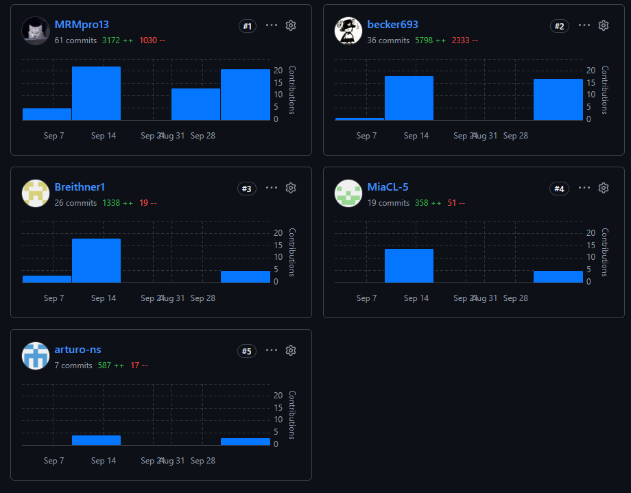

<strong>Universidad Peruana de Ciencias Aplicadas</strong>

<strong>Carrera de Ingeniería de Software</strong>

 

<strong>1ACC0238</strong>

<strong>Aplicaciones para Dispositivos Móviles</strong>

NRC

<strong>13981</strong>

<h2 align="center">Informe del Trabajo Final</h2>

Docente

<strong>Mayta Guillermo, Jorge Luis</strong>

 

Equipo

<strong>NovaCorp</strong>

Proyecto

<strong>InmoNode</strong>

 

<strong>Integrantes</strong>

<table align="center" style="display: table; width: auto; margin-left: auto; margin-right: auto;">
  <tr><th>Código</th><th>Apellidos y nombres</th></tr>
  <tr><td align="center">U202419462</td><td align="center">Caisahuana Osores, Becker Junior</td></tr>
  <tr><td align="center">U20241C101</td><td align="center">Capillo Lema, Mía Valentina</td></tr>
  <tr><td align="center">U20231E795</td><td align="center">Nuñez Soto, Andy Arturo</td></tr>
  <tr><td align="center">U202418577</td><td align="center">Perez Encarnacion, Breithner Rodolfo</td></tr>
  <tr><td align="center">U20231E515</td><td align="center">Rocca Mariaca, Angel Mathias</td></tr>
</table>

 

<strong>Período 202620</strong>

<strong>Octubre 2026</strong>

# Registro de Versiones del Informe

---

La [Tabla P.1](#tabla-P-1) registra la evolución del informe y las correcciones incorporadas.

**Tabla P.1**

*Registro de versiones del informe*

| Versión | Fecha     | Autor                        | Descripción de modificación |
|---------|-----------|------------------------------|-----------------------------|
| 1.0 | 9/09/2026 | Rocca Mariaca, Angel Mathias | Creación del reporte en formato Markdown. |
| 1.1 | 07/10/2026 | NovaCorp | Ajuste de carátula según plantilla oficial, objetivos SMART individuales, índice, saltos de página y referencias de tablas de las secciones preliminares. |
| 1.2 | 10/10/2026 | NovaCorp | TB1: corrección de las observaciones de la entrega anterior, incorporación del Capítulo III (Solution UI/UX Design) y del Capítulo IV (Product Implementation & Validation, Sprint 1), y actualización del índice, del Student Outcome y de los objetivos SMART. |

La carátula presenta el logo institucional de la UPC y la relación de integrantes en orden alfabético, siguiendo la disposición de la plantilla oficial del curso.

# Project Report Collaboration Insights

---

TB1:

La captura muestra las contribuciones de cada integrante al repositorio del informe

---

La [Tabla P.2](#tabla-P-2) identifica el repositorio utilizado para la elaboración colaborativa del informe.

**Tabla P.2**

*Repositorio colaborativo del informe*

| Enlace del repositorio del informe del proyecto                                      |
|--------------------------------------------------------------------------------------|
| https://github.com/1ACC0238-2620-13981-NovaCorp-InmoNode/InmoNode-Project-Report.git |

# Contenido

## Tabla de Contenidos

- [Registro de Versiones del Informe](#registro-de-versiones-del-informe)
- [Project Report Collaboration Insights](#project-report-collaboration-insights)
- [Student Outcome](#student-outcome)
- [Objetivos SMART](#objetivos-smart)
- [Capítulo I: Presentación](docs/Chapter-01.md)
  - [1.1. Startup Profile](docs/Chapter-01.md#11-startup-profile)
    - [1.1.1. Descripción de la Startup](docs/Chapter-01.md#111-descripción-de-la-startup)
    - [1.1.2. Perfiles de integrantes del equipo](docs/Chapter-01.md#112-perfiles-de-integrantes-del-equipo)
  - [1.2. Solution Profile](docs/Chapter-01.md#12-solution-profile)
    - [1.2.1. Antecedentes y problemática](docs/Chapter-01.md#121-antecedentes-y-problemática)
    - [1.2.2. Lean UX Process](docs/Chapter-01.md#122-lean-ux-process)
      - [1.2.2.1. Lean UX Problem Statements](docs/Chapter-01.md#1221-lean-ux-problem-statements)
      - [1.2.2.2. Lean UX Assumptions](docs/Chapter-01.md#1222-lean-ux-assumptions)
      - [1.2.2.3. Lean UX Hypothesis Statements](docs/Chapter-01.md#1223-lean-ux-hypothesis-statements)
      - [1.2.2.4. Lean UX Canvas](docs/Chapter-01.md#1224-lean-ux-canvas)
  - [1.3. Segmentos objetivo](docs/Chapter-01.md#13-segmentos-objetivo)
- [Capítulo II: Requirements Development and Software Solution Design](docs/Chapter-02.md)
  - [2.1. Competidores](docs/Chapter-02.md#21-competidores)
    - [2.1.1. Análisis competitivo](docs/Chapter-02.md#211-análisis-competitivo)
    - [2.1.2. Estrategias y tácticas frente a competidores](docs/Chapter-02.md#212-estrategias-y-tácticas-frente-a-competidores)
  - [2.2. Entrevistas](docs/Chapter-02.md#22-entrevistas)
    - [2.2.1. Diseño de entrevistas](docs/Chapter-02.md#221-diseño-de-entrevistas)
    - [2.2.2. Registro de entrevistas](docs/Chapter-02.md#222-registro-de-entrevistas)
    - [2.2.3. Análisis de entrevistas](docs/Chapter-02.md#223-análisis-de-entrevistas)
  - [2.3. Needfinding](docs/Chapter-02.md#23-needfinding)
    - [2.3.1. User Personas](docs/Chapter-02.md#231-user-personas)
    - [2.3.2. User Task Matrix](docs/Chapter-02.md#232-user-task-matrix)
    - [2.3.3. User Journey Mapping](docs/Chapter-02.md#233-user-journey-mapping)
    - [2.3.4. Empathy Mapping](docs/Chapter-02.md#234-empathy-mapping)
    - [2.3.5. Big Picture EventStorming](docs/Chapter-02.md#235-big-picture-eventstorming)
    - [2.3.6. Ubiquitous Language](docs/Chapter-02.md#236-ubiquitous-language)
  - [2.4. Requirements specification](docs/Chapter-02.md#24-requirements-specification)
    - [2.4.1. User Stories](docs/Chapter-02.md#241-user-stories)
    - [2.4.2. Impact Mapping](docs/Chapter-02.md#242-impact-mapping)
    - [2.4.3. Product Backlog](docs/Chapter-02.md#243-product-backlog)
  - [2.5. Strategic-Level Domain-Driven Design](docs/Chapter-02.md#25-strategic-level-domain-driven-design)
    - [2.5.1. EventStorming](docs/Chapter-02.md#251-eventstorming)
      - [2.5.1.1. Candidate Context Discovery](docs/Chapter-02.md#2511-candidate-context-discovery)
      - [2.5.1.2. Domain Message Flows Modeling](docs/Chapter-02.md#2512-domain-message-flows-modeling)
      - [2.5.1.3. Bounded Context Canvases](docs/Chapter-02.md#2513-bounded-context-canvases)
    - [2.5.2. Context Mapping](docs/Chapter-02.md#252-context-mapping)
    - [2.5.3. Software Architecture](docs/Chapter-02.md#253-software-architecture)
      - [2.5.3.1. Software Architecture Context Level Diagrams](docs/Chapter-02.md#2531-software-architecture-context-level-diagrams)
      - [2.5.3.2. Software Architecture Container Level Diagrams](docs/Chapter-02.md#2532-software-architecture-container-level-diagrams)
      - [2.5.3.3. Software Architecture Deployment Diagrams](docs/Chapter-02.md#2533-software-architecture-deployment-diagrams)
  - [2.6. Tactical-Level Domain-Driven Design](docs/Chapter-02.md#26-tactical-level-domain-driven-design)
    - [2.6.1. Bounded Context: Gestión Comercial en Campo](docs/Chapter-02.md#261-bounded-context-gestión-comercial-en-campo)
      - [2.6.1.1. Domain Layer](docs/Chapter-02.md#2611-domain-layer)
      - [2.6.1.2. Interface Layer](docs/Chapter-02.md#2612-interface-layer)
      - [2.6.1.3. Application Layer](docs/Chapter-02.md#2613-application-layer)
      - [2.6.1.4. Infrastructure Layer](docs/Chapter-02.md#2614-infrastructure-layer)
      - [2.6.1.5. Bounded Context Software Architecture Component Level Diagrams](docs/Chapter-02.md#2615-bounded-context-software-architecture-component-level-diagrams)
      - [2.6.1.6. Bounded Context Software Architecture Code Level Diagrams](docs/Chapter-02.md#2616-bounded-context-software-architecture-code-level-diagrams)
        - [2.6.1.6.1. Bounded Context Domain Layer Class Diagrams](docs/Chapter-02.md#26161-bounded-context-domain-layer-class-diagrams)
        - [2.6.1.6.2. Bounded Context Database Design Diagram](docs/Chapter-02.md#26162-bounded-context-database-design-diagram)
    - [2.6.2. Bounded Context: Gestión de Comprobantes](docs/Chapter-02.md#262-bounded-context-gestión-de-comprobantes)
      - [2.6.2.1. Domain Layer](docs/Chapter-02.md#2621-domain-layer)
      - [2.6.2.2. Interface Layer](docs/Chapter-02.md#2622-interface-layer)
      - [2.6.2.3. Application Layer](docs/Chapter-02.md#2623-application-layer)
      - [2.6.2.4. Infrastructure Layer](docs/Chapter-02.md#2624-infrastructure-layer)
      - [2.6.2.5. Bounded Context Software Architecture Component Level Diagrams](docs/Chapter-02.md#2625-bounded-context-software-architecture-component-level-diagrams)
      - [2.6.2.6. Bounded Context Software Architecture Code Level Diagrams](docs/Chapter-02.md#2626-bounded-context-software-architecture-code-level-diagrams)
        - [2.6.2.6.1. Bounded Context Domain Layer Class Diagrams](docs/Chapter-02.md#26261-bounded-context-domain-layer-class-diagrams)
        - [2.6.2.6.2. Bounded Context Database Design Diagram](docs/Chapter-02.md#26262-bounded-context-database-design-diagram)
    - [2.6.3. Bounded Context: Cotización y Separación Digital](docs/Chapter-02.md#263-bounded-context-cotización-y-separación-digital)
      - [2.6.3.1. Domain Layer](docs/Chapter-02.md#2631-domain-layer)
      - [2.6.3.2. Interface Layer](docs/Chapter-02.md#2632-interface-layer)
      - [2.6.3.3. Application Layer](docs/Chapter-02.md#2633-application-layer)
      - [2.6.3.4. Infrastructure Layer](docs/Chapter-02.md#2634-infrastructure-layer)
      - [2.6.3.5. Bounded Context Software Architecture Component Level Diagrams](docs/Chapter-02.md#2635-bounded-context-software-architecture-component-level-diagrams)
      - [2.6.3.6. Bounded Context Software Architecture Code Level Diagrams](docs/Chapter-02.md#2636-bounded-context-software-architecture-code-level-diagrams)
        - [2.6.3.6.1. Bounded Context Domain Layer Class Diagrams](docs/Chapter-02.md#26361-bounded-context-domain-layer-class-diagrams)
        - [2.6.3.6.2. Bounded Context Database Design Diagram](docs/Chapter-02.md#26362-bounded-context-database-design-diagram)
    - [2.6.4. Bounded Context: Control Financiero y Documental](docs/Chapter-02.md#264-bounded-context-control-financiero-y-documental)
      - [2.6.4.1. Domain Layer](docs/Chapter-02.md#2641-domain-layer)
      - [2.6.4.2. Interface Layer](docs/Chapter-02.md#2642-interface-layer)
      - [2.6.4.3. Application Layer](docs/Chapter-02.md#2643-application-layer)
      - [2.6.4.4. Infrastructure Layer](docs/Chapter-02.md#2644-infrastructure-layer)
      - [2.6.4.5. Bounded Context Software Architecture Component Level Diagrams](docs/Chapter-02.md#2645-bounded-context-software-architecture-component-level-diagrams)
      - [2.6.4.6. Bounded Context Software Architecture Code Level Diagrams](docs/Chapter-02.md#2646-bounded-context-software-architecture-code-level-diagrams)
        - [2.6.4.6.1. Bounded Context Domain Layer Class Diagrams](docs/Chapter-02.md#26461-bounded-context-domain-layer-class-diagrams)
        - [2.6.4.6.2. Bounded Context Database Design Diagram](docs/Chapter-02.md#26462-bounded-context-database-design-diagram)
    - [2.6.5. Bounded Context: Catálogo Inmobiliario](docs/Chapter-02.md#265-bounded-context-catálogo-inmobiliario)
      - [2.6.5.1. Domain Layer](docs/Chapter-02.md#2651-domain-layer)
      - [2.6.5.2. Interface Layer](docs/Chapter-02.md#2652-interface-layer)
      - [2.6.5.3. Application Layer](docs/Chapter-02.md#2653-application-layer)
      - [2.6.5.4. Infrastructure Layer](docs/Chapter-02.md#2654-infrastructure-layer)
      - [2.6.5.5. Bounded Context Software Architecture Component Level Diagrams](docs/Chapter-02.md#2655-bounded-context-software-architecture-component-level-diagrams)
      - [2.6.5.6. Bounded Context Software Architecture Code Level Diagrams](docs/Chapter-02.md#2656-bounded-context-software-architecture-code-level-diagrams)
        - [2.6.5.6.1. Bounded Context Domain Layer Class Diagrams](docs/Chapter-02.md#26561-bounded-context-domain-layer-class-diagrams)
        - [2.6.5.6.2. Bounded Context Database Design Diagram](docs/Chapter-02.md#26562-bounded-context-database-design-diagram)
- [Capítulo III: Solution UI/UX Design](docs/Chapter-03.md)
  - [3.1. Product design](docs/Chapter-03.md#31-product-design)
    - [3.1.1. Style Guidelines](docs/Chapter-03.md#311-style-guidelines)
      - [3.1.1.1. General Style Guidelines](docs/Chapter-03.md#3111-general-style-guidelines)
    - [3.1.2. Information Architecture](docs/Chapter-03.md#312-information-architecture)
      - [3.1.2.1. Organization Systems](docs/Chapter-03.md#3121-organization-systems)
      - [3.1.2.2. Labelling Systems](docs/Chapter-03.md#3122-labelling-systems)
      - [3.1.2.3. SEO Tags and Meta Tags](docs/Chapter-03.md#3123-seo-tags-and-meta-tags)
      - [3.1.2.4. Searching Systems](docs/Chapter-03.md#3124-searching-systems)
      - [3.1.2.5. Navigation Systems](docs/Chapter-03.md#3125-navigation-systems)
    - [3.1.3. Landing Page UI Design](docs/Chapter-03.md#313-landing-page-ui-design)
      - [3.1.3.1. Landing Page Wireframe](docs/Chapter-03.md#3131-landing-page-wireframe)
      - [3.1.3.2. Landing Page Mock-up](docs/Chapter-03.md#3132-landing-page-mock-up)
    - [3.1.4. Mobile Applications UX/UI Design](docs/Chapter-03.md#314-mobile-applications-uxui-design)
      - [3.1.4.1. Mobile Applications Wireframes](docs/Chapter-03.md#3141-mobile-applications-wireframes)
      - [3.1.4.2. Mobile Applications Wireflow Diagrams](docs/Chapter-03.md#3142-mobile-applications-wireflow-diagrams)
      - [3.1.4.3. Mobile Applications Mock-ups](docs/Chapter-03.md#3143-mobile-applications-mock-ups)
      - [3.1.4.4. Mobile Applications User Flow Diagrams](docs/Chapter-03.md#3144-mobile-applications-user-flow-diagrams)
      - [3.1.4.5. Mobile Applications Prototyping](docs/Chapter-03.md#3145-mobile-applications-prototyping)
- [Capítulo IV: Product Implementation & Validation](docs/Chapter-04.md)
  - [4.1. Software Configuration Management](docs/Chapter-04.md#41-software-configuration-management)
    - [4.1.1. Software Development Environment Configuration](docs/Chapter-04.md#411-software-development-environment-configuration)
    - [4.1.2. Source Code Management](docs/Chapter-04.md#412-source-code-management)
    - [4.1.3. Source Code Style Guide & Conventions](docs/Chapter-04.md#413-source-code-style-guide--conventions)
    - [4.1.4. Software Deployment Configuration](docs/Chapter-04.md#414-software-deployment-configuration)
  - [4.2. Landing Page & Mobile Application Implementation](docs/Chapter-04.md#42-landing-page--mobile-application-implementation)
    - [4.2.1. Sprint 1](docs/Chapter-04.md#421-sprint-1)
      - [4.2.1.1. Sprint Planning 1](docs/Chapter-04.md#4211-sprint-planning-1)
      - [4.2.1.2. Aspect Leaders and Collaborators](docs/Chapter-04.md#4212-aspect-leaders-and-collaborators)
      - [4.2.1.3. Sprint Backlog 1](docs/Chapter-04.md#4213-sprint-backlog-1)
      - [4.2.1.4. Development Evidence for Sprint Review](docs/Chapter-04.md#4214-development-evidence-for-sprint-review)
      - [4.2.1.5. Testing Suite Evidence for Sprint Review](docs/Chapter-04.md#4215-testing-suite-evidence-for-sprint-review)
      - [4.2.1.6. Execution Evidence for Sprint Review](docs/Chapter-04.md#4216-execution-evidence-for-sprint-review)
      - [4.2.1.7. Services Documentation Evidence for Sprint Review](docs/Chapter-04.md#4217-services-documentation-evidence-for-sprint-review)
      - [4.2.1.8. Software Deployment Evidence for Sprint Review](docs/Chapter-04.md#4218-software-deployment-evidence-for-sprint-review)
      - [4.2.1.9. Team Collaboration Insights during Sprint](docs/Chapter-04.md#4219-team-collaboration-insights-during-sprint)

# Student Outcome

---

El curso contribuye al cumplimiento del Student Outcome ABET:

**ABET – EAC - Student Outcome 7**

Criterio: La capacidad de adquirir y aplicar nuevos conocimientos según sea necesario, utilizando estrategias de aprendizaje apropiadas.

En el siguiente cuadro se describe las acciones realizadas y enunciados de conclusiones por parte del grupo, que permiten sustentar el haber alcanzado el logro del ABET – EAC - Student Outcome 7.

La [Tabla P.3](#tabla-P-3) relaciona las acciones y conclusiones del equipo con los criterios 7.c1 y 7.c2 del Student Outcome 7.

**Tabla P.3**

*Acciones y conclusiones del Student Outcome 7*

| Criterio específico | Acciones realizadas                                                                                                                                                                                                                                                                                                                                                                                                                                                                                                                                                                                                                                                                                                                                                                                                                                                                                                                                 | Conclusiones                                                                                                                                                                                                                                                                                                                               |
| --- |-----------------------------------------------------------------------------------------------------------------------------------------------------------------------------------------------------------------------------------------------------------------------------------------------------------------------------------------------------------------------------------------------------------------------------------------------------------------------------------------------------------------------------------------------------------------------------------------------------------------------------------------------------------------------------------------------------------------------------------------------------------------------------------------------------------------------------------------------------------------------------------------------------------------------------------------------------|--------------------------------------------------------------------------------------------------------------------------------------------------------------------------------------------------------------------------------------------------------------------------------------------------------------------------------------------|
| **7.c1. Actualiza conceptos y conocimientos necesarios para su desarrollo profesional y en especial para su proyecto en soluciones de ingeniería de software.** | AV1: **Becker Caisahuana:** Investigó herramientas de modelado de experiencia de usuario (UXPressia) para desarrollar Needfinding (Personas, Empathy/Journey Maps) y patrones tácticos de Domain-Driven Design (DDD) aplicados a contextos offline. **Mía Capillo:** Profundizó en técnicas de investigación cualitativa (Needfinding) para el diseño, ejecución y análisis de entrevistas estructuradas a los segmentos comerciales. **Angel Rocca:** Estudió herramientas de análisis estratégico (SWOT) y modelado arquitectónico avanzado usando C4 Model y Context Mapping. **Breithner Perez:** Adquirió conocimientos en metodologías Lean UX (Problem/Hypothesis Statements) y talleres colaborativos de arquitectura como Big Picture EventStorming. **Andy Nuñez:** Se capacitó en gestión ágil de requerimientos (Product Backlog), Candidate Context Discovery y diagramación de flujos de mensajes (Domain Message Flows).  TB1: **Becker Caisahuana:** Investigó cómo sustentar un Sprint con evidencias verificables: pruebas unitarias y de integración con JUnit, Mockito y Testcontainers, documentación de servicios RESTful con OpenAPI/Swagger y despliegue con Docker y Render, para elaborar el Sprint Backlog 1 y las evidencias de desarrollo, pruebas, ejecución, documentación y despliegue. **Mía Capillo:** Estudió la construcción de guías de estilo (branding, paleta de colores, tipografía y retícula de 8 px) y el diseño de wireframes y mock-ups responsivos en Figma para definir las General Style Guidelines y la Landing Page en Desktop y Mobile Web Browser. **Angel Rocca:** Profundizó en diseño UX/UI para Android en Figma, aprendiendo a elaborar wireframes, wireflows, mock-ups, user flow diagrams y un prototipo navegable de las 31 pantallas de la aplicación de ventas en campo. **Breithner Perez:** Adquirió conocimientos de arquitectura de la información para definir los sistemas de organización, etiquetado, búsqueda y navegación, así como los SEO tags y meta tags de la plataforma web y la aplicación móvil. **Andy Nuñez:** Se capacitó en gestión de la configuración de software: modelo de ramas (main, develop, feature, release y hotfix), Conventional Commits, Semantic Versioning, guías de estilo por lenguaje y configuración de despliegue con Vercel, Render, Supabase y Firebase App Distribution, además de la planificación del Sprint 1. | AV1: El equipo demostró la capacidad de investigar y aplicar de forma autónoma marcos de trabajo avanzados de diseño de software (DDD, Lean UX, C4 Model, EventStorming) que no se cubren en su totalidad en los cursos introductorios, logrando adaptar estas metodologías a las necesidades reales del proyecto InmoNode.  TB1: El equipo actualizó sus conocimientos en diseño UX/UI (guías de estilo, arquitectura de la información, wireframes, mock-ups y prototipado en Figma) y en implementación de software (gestión de la configuración, pruebas automatizadas, documentación OpenAPI y despliegue en la nube), y los aplicó en los capítulos III y IV y en el Sprint 1 de InmoNode. |
| **7.c2. Reconoce la necesidad del aprendizaje permanente para el desempeño profesional y el desarrollo de proyectos en soluciones de tecnologías de ingeniería de software.** | AV1: **Becker Caisahuana:** Aplicó el autoaprendizaje para estructurar el Tactical DDD del Bounded Context de Gestión Comercial y el User Task Matrix. **Mía Capillo:** Validó y adaptó de forma iterativa sus resúmenes descriptivos tras analizar las grabaciones de los usuarios reales. **Angel Rocca:** Iteró la arquitectura de software investigando cómo separar el Control Financiero de la Cotización Digital. **Breithner Perez:** Reconoció la importancia de los lenguajes ubicuos (Ubiquitous Language) y el Impact Mapping como herramientas de alineación continua entre negocio y tecnología. **Andy Nuñez:** Documentó de manera exhaustiva los Bounded Context Canvases asimilando iterativamente la complejidad técnica del dominio.  TB1: **Becker Caisahuana:** Aplicó el autoaprendizaje para organizar la matriz de liderazgo y colaboración (LACX), descomponer las historias del Sprint 1 en tareas dentro de Trello y analizar la colaboración del equipo a partir del historial de Git y GitHub Pulse. **Mía Capillo:** Iteró los wireframes y mock-ups de la Landing Page aplicando criterios de diseño inclusivo (contraste, jerarquía tipográfica y áreas táctiles mínimas de 48 × 48 px) y sustentó cada decisión de UI frente a la historia US-P01. **Angel Rocca:** Relacionó cada pantalla con sus historias de usuario y con los recursos del backend, e incorporó en los flujos los caminos alternos de los escenarios Gherkin (modo sin conexión, conflictos de sincronización y voucher rechazado), reconociendo la necesidad de validar el diseño con un prototipo antes de desarrollar código. **Breithner Perez:** Reconoció la importancia de mantener el Ubiquitous Language del dominio en las etiquetas de la interfaz y de adaptar la búsqueda y la navegación al trabajo sin conexión del agente de campo. **Andy Nuñez:** Evaluó de forma autónoma herramientas y servicios de plan gratuito para el entorno de desarrollo y el despliegue, y los alineó con la arquitectura definida en el Capítulo II y con el Sprint Planning 1 (seis historias y 21 Story Points). | AV1: Los integrantes del equipo comprenden que la construcción de un producto de software escalable exige un proceso de investigación y validación tecnológica constante. Cada miembro asumió el reto de especializarse en componentes específicos del ciclo de vida del software, demostrando un compromiso claro con la mejora continua.  TB1: Al corregir las observaciones de la entrega anterior y pasar del diseño a la implementación, el equipo reconoció que cada etapa del producto exige aprender herramientas y prácticas nuevas. Cada integrante asumió un aspecto distinto (diseño visual, arquitectura de la información, diseño móvil, configuración y despliegue, y evidencias del Sprint) y lo sustentó con resultados verificables en el informe y en los repositorios. |

# Objetivos SMART

Los siguientes objetivos constituyen un plan de desarrollo profesional después de finalizar la carrera. Cada integrante plantea dos metas específicas, medibles, alcanzables, relevantes y con un plazo definido. Los plazos se cuentan desde la graduación y el avance se revisará mediante las evidencias indicadas.

La [Tabla P.4](#tabla-P-4) presenta los dos objetivos de cada integrante y detalla los cinco criterios SMART para su seguimiento.

**Tabla P.4**

*Plan de desarrollo profesional: objetivos SMART por integrante*

| Integrante | Objetivo SMART 1 | Objetivo SMART 2 |
|-----------|------------------|------------------|
| **Caisahuana Osores, Becker Junior — U202419462** | **1. Certificación en bases de datos relacionales** **Específico:** Obtener una certificación de nivel asociado en SQL y bases de datos relacionales, como Oracle Database SQL Certified Associate.  **Medible:** El certificado emitido y un simulacro previo aprobado con al menos 80 % de aciertos.  **Alcanzable:** Dedicar cinco horas semanales al material oficial y a ejercicios prácticos sobre PostgreSQL.  **Relevante:** Respaldar ante empleadores mi especialidad en modelado y persistencia de datos.  **Plazo:** 8 meses después de la graduación. | **2. Optimización de consultas en un sistema real** **Específico:** Reducir en al menos 30 % el tiempo de respuesta de las cinco consultas más lentas de un sistema en el que trabaje o de un proyecto de código abierto.  **Medible:** Cinco consultas optimizadas, cada una con su plan de ejecución y su medición antes y después, reunidas en un informe técnico publicado.  **Alcanzable:** Trabajar tres horas semanales sobre una copia con datos de prueba, aplicando índices, particionamiento y reescritura de consultas.  **Relevante:** Desempeñarme como desarrollador backend orientado a datos con resultados demostrables.  **Plazo:** 18 meses después de la graduación. |
| **Capillo Lema, Mía Valentina — U20241C101** | **1. Certificación en accesibilidad digital** **Específico:** Obtener la certificación CPACC (Certified Professional in Accessibility Core Competencies) de la IAAP.  **Medible:** El certificado emitido tras aprobar el examen.  **Alcanzable:** Estudiar cuatro horas semanales el temario oficial de la IAAP y las pautas WCAG 2.2 durante seis meses antes de rendir el examen.  **Relevante:** Sustentar formalmente mi enfoque de diseño inclusivo.  **Plazo:** 10 meses después de la graduación. | **2. Portafolio de UX con investigación con usuarios** **Específico:** Publicar un portafolio con tres casos de estudio de productos digitales, cada uno con investigación con al menos seis usuarios, prototipo en Figma y auditoría de accesibilidad WCAG nivel AA.  **Medible:** Tres casos publicados, dieciocho sesiones con usuarios registradas y tres informes de auditoría.  **Alcanzable:** Completar un caso cada cinco meses a partir de proyectos independientes o de voluntariado.  **Relevante:** Postular a puestos de diseño UX/UI con evidencia del proceso completo, desde la investigación hasta la evaluación.  **Plazo:** 15 meses después de la graduación. |
| **Nuñez Soto, Andy Arturo — U20231E795** | **1. Aplicación web publicada con métricas de rendimiento** **Específico:** Publicar en producción una aplicación web desarrollada con Angular que consuma una API REST y alcance al menos 90 puntos en rendimiento y en accesibilidad en Lighthouse.  **Medible:** Una URL pública, el repositorio y los reportes de Lighthouse con 90 puntos o más en ambas categorías.  **Alcanzable:** Dedicar cinco horas semanales al desarrollo, desplegar en un servicio gratuito y medir y optimizar la aplicación cada mes.  **Relevante:** Demostrar que puedo construir interfaces fluidas y bien integradas con el servidor.  **Plazo:** 6 meses después de la graduación. | **2. Contribución a proyectos de código abierto** **Específico:** Lograr la integración de cinco pull requests en proyectos de código abierto de frontend, como bibliotecas de componentes o herramientas de desarrollo.  **Medible:** Cinco pull requests fusionados y visibles en mi perfil de GitHub.  **Alcanzable:** Empezar por incidencias etiquetadas para nuevos colaboradores y enviar un pull request cada dos o tres meses.  **Relevante:** Adquirir experiencia con la revisión de código y los estándares de equipos distribuidos.  **Plazo:** 14 meses después de la graduación. |
| **Perez Encarnacion, Breithner Rodolfo — U202418577** | **1. Certificación ISTQB Foundation Level** **Específico:** Aprobar el examen ISTQB Certified Tester Foundation Level.  **Medible:** El certificado emitido y dos simulacros previos con al menos 75 % de aciertos.  **Alcanzable:** Estudiar cuatro horas semanales el programa de estudios oficial durante cuatro meses antes de rendir el examen.  **Relevante:** Formalizar mis conocimientos de aseguramiento de calidad de software.  **Plazo:** 6 meses después de la graduación. | **2. Integración y entrega continua con pruebas automatizadas** **Específico:** Implementar, en un proyecto propio o laboral, un pipeline con GitHub Actions que ejecute pruebas automatizadas con al menos 80 % de cobertura y despliegue cada versión en un entorno de pruebas.  **Medible:** El pipeline versionado, un reporte de cobertura de 80 % o más y diez versiones etiquetadas y desplegadas.  **Alcanzable:** Dedicar tres horas semanales a ampliar la cobertura de forma progresiva y a publicar una versión cada mes.  **Relevante:** Orientar mi carrera hacia la automatización de pruebas y la entrega de software.  **Plazo:** 16 meses después de la graduación. |
| **Rocca Mariaca, Angel Mathias — U20231E515** | **1. Certificación en arquitectura en la nube** **Específico:** Obtener la certificación AWS Certified Solutions Architect – Associate.  **Medible:** El certificado emitido y dos exámenes de práctica con al menos 80 % de aciertos.  **Alcanzable:** Dedicar cinco horas semanales al estudio y a laboratorios en la capa gratuita de AWS.  **Relevante:** Sustentar mis decisiones de arquitectura con criterios de escalabilidad, seguridad y costo.  **Plazo:** 9 meses después de la graduación. | **2. Servicio de extracción documental con OCR** **Específico:** Publicar como código abierto un servicio que extraiga monto, fecha y código de operación de comprobantes de pago con al menos 92 % de exactitud por campo, y difundir sus resultados en un artículo técnico.  **Medible:** Un repositorio público, un reporte de métricas sobre 200 comprobantes de prueba y un artículo publicado.  **Alcanzable:** Avanzar en iteraciones mensuales con comprobantes sintéticos y registrar las métricas de cada iteración.  **Relevante:** Especializarme en la integración de OCR e inteligencia artificial aplicada a documentos.  **Plazo:** 20 meses después de la graduación. |
