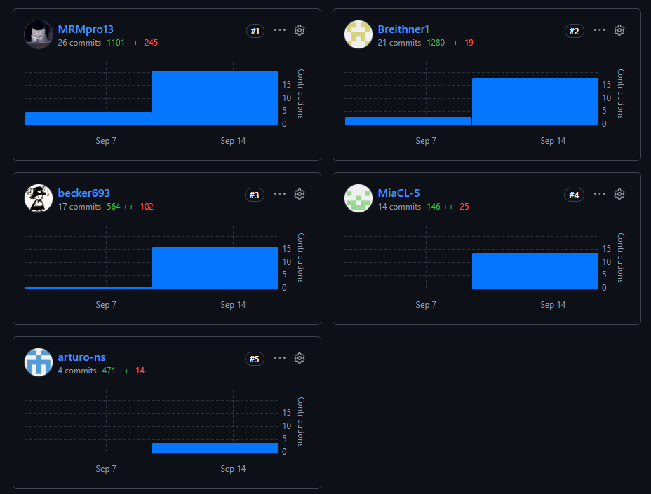



#### Universidad Peruana de Ciencias Aplicadas

#### Carrera de Ingeniería de Software

 

#### <b> 1ACC0238 </b>

#### <b> Aplicaciones para Dispositivos Móviles </b>

#### NRC

#### <b> 13981 </b>

#### <b> Informe del Trabajo Final </b>

#### Docente

#### <b> Mayta Guillermo, Jorge Luis </b>

 

#### Equipo

#### <b> NovaCorp </b>

#### Proyecto

#### <b> InmoNode </b>

 

#### <b> Integrantes </b>

| <b> Código </b> |     <b> Apellidos y Nombres </b>     |
|:---------------:|:------------------------------------:|
|   U202419462    |   Caisahuana Osores, Becker Junior   |
|   U20241C101    |     Capillo Lema, Mía Valentina      |
|   U20231E795    |       Nuñez Soto, Andy Arturo        |
|   U202418577    | Perez Encarnacion, Breithner Rodolfo |
|   U20231E515    |     Rocca Mariaca, Angel Mathias     |

#### Período 202620

#### Septiembre 2026

# Registro de Versiones del Informe

---

| Versión | Fecha     | Autor                        | Descripción de modificación |
|---------|-----------|------------------------------|-----------------------------|
| 1.0 | 9/09/2026 | Rocca Mariaca, Angel Mathias | Creación del reporte en formato Markdown. |

# Project Report Collaboration Insights

---

AV1:

---

| Enlace del repositorio del informe del proyecto                                      |
|--------------------------------------------------------------------------------------|
| https://github.com/1ACC0238-2620-13981-NovaCorp-InmoNode/InmoNode-Project-Report.git |

# Student Outcome

---

El curso contribuye al cumplimiento del Student Outcome ABET:

**ABET – EAC - Student Outcome 7**

Criterio: La capacidad de adquirir y aplicar nuevos conocimientos según sea necesario, utilizando estrategias de aprendizaje apropiadas.

En el siguiente cuadro se describe las acciones realizadas y enunciados de conclusiones por parte del grupo, que permiten sustentar el haber alcanzado el logro del ABET – EAC - Student Outcome 7.

| Criterio específico | Acciones realizadas                                                                                                                                                                                                                                                                                                                                                                                                                                                                                                                                                                                                                                                                                                                                                                                                                                                                                                                                 | Conclusiones                                                                                                                                                                                                                                                                                                                               |
| --- |-----------------------------------------------------------------------------------------------------------------------------------------------------------------------------------------------------------------------------------------------------------------------------------------------------------------------------------------------------------------------------------------------------------------------------------------------------------------------------------------------------------------------------------------------------------------------------------------------------------------------------------------------------------------------------------------------------------------------------------------------------------------------------------------------------------------------------------------------------------------------------------------------------------------------------------------------------|--------------------------------------------------------------------------------------------------------------------------------------------------------------------------------------------------------------------------------------------------------------------------------------------------------------------------------------------|
| **7.c1. Actualiza conceptos y conocimientos necesarios para su desarrollo profesional y en especial para su proyecto en soluciones de ingeniería de software.** | AV1: **Becker Caisahuana:** Investigó herramientas de modelado de experiencia de usuario (UXPressia) para desarrollar Needfinding (Personas, Empathy/Journey Maps) y patrones tácticos de Domain-Driven Design (DDD) aplicados a contextos offline. **Mía Capillo:** Profundizó en técnicas de investigación cualitativa (Needfinding) para el diseño, ejecución y análisis de entrevistas estructuradas a los segmentos comerciales. **Angel Rocca:** Estudió herramientas de análisis estratégico (SWOT) y modelado arquitectónico avanzado usando C4 Model y Context Mapping. **Breithner Perez:** Adquirió conocimientos en metodologías Lean UX (Problem/Hypothesis Statements) y talleres colaborativos de arquitectura como Big Picture EventStorming. **Andy Nuñez:** Se capacitó en gestión ágil de requerimientos (Product Backlog), Candidate Context Discovery y diagramación de flujos de mensajes (Domain Message Flows). | AV1: El equipo demostró la capacidad de investigar y aplicar de forma autónoma marcos de trabajo avanzados de diseño de software (DDD, Lean UX, C4 Model, EventStorming) que no se cubren en su totalidad en los cursos introductorios, logrando adaptar estas metodologías a las necesidades reales del proyecto InmoNode.                |
| **7.c2. Reconoce la necesidad del aprendizaje permanente para el desempeño profesional y el desarrollo de proyectos en soluciones de tecnologías de ingeniería de software.** | AV1:  **Becker Caisahuana:** Aplicó el autoaprendizaje para estructurar el Tactical DDD del Bounded Context de Gestión Comercial y el User Task Matrix. **Mía Capillo:** Validó y adaptó de forma iterativa sus resúmenes descriptivos tras analizar las grabaciones de los usuarios reales. **Angel Rocca:** Iteró la arquitectura de software investigando cómo separar el Control Financiero de la Cotización Digital. **Breithner Perez:** Reconoció la importancia de los lenguajes ubicuos (Ubiquitous Language) y el Impact Mapping como herramientas de alineación continua entre negocio y tecnología. **Andy Nuñez:** Documentó de manera exhaustiva los Bounded Context Canvases asimilando iterativamente la complejidad técnica del dominio.                                                                                                                                                                               | AV1: Los integrantes del equipo comprenden que la construcción de un producto de software escalable exige un proceso de investigación y validación tecnológica constante. Cada miembro asumió el reto de especializarse en componentes específicos del ciclo de vida del software, demostrando un compromiso claro con la mejora continua. |

# Contenido

---

## Tabla de Contenidos

---

- [Capítulo III: Solution UI/UX Design](docs/Chapter-03.md#capítulo-iii-solution-uiux-design)
  - [3.1. Product design](docs/Chapter-03.md#31-product-design)
    - [3.1.1. Style Guidelines](docs/Chapter-03.md#311-style-guidelines)
      - [3.1.1.1. General Style Guidelines](docs/Chapter-03.md#3111-general-style-guidelines)
    - [3.1.2. Information Architecture](docs/Chapter-03.md#312-information-architecture)
      - [3.1.2.1. Organization Systems](docs/Chapter-03.md#3121-organization-systems)
      - [3.1.2.2. Labelling Systems](docs/Chapter-03.md#3122-labelling-systems)
      - [3.1.2.3. SEO Tags and Meta Tags](docs/Chapter-03.md#3123-seo-tags-and-meta-tags)
      - [3.1.2.4. Searching Systems](docs/Chapter-03.md#3124-searching-systems)
      - [3.1.2.5. Navigation Systems](docs/Chapter-03.md#3125-navigation-systems)
    - [3.1.3. Landing Page UI Design](docs/Chapter-03.md#313-landing-page-ui-design)
      - [3.1.3.1. Landing Page Wireframe](docs/Chapter-03.md#3131-landing-page-wireframe)
      - [3.1.3.2. Landing Page Mock-up](docs/Chapter-03.md#3132-landing-page-mock-up)
    - [3.1.4. Mobile Applications UX/UI Design](docs/Chapter-03.md#314-mobile-applications-uxui-design)
      - [3.1.4.1. Mobile Applications Wireframes](docs/Chapter-03.md#3141-mobile-applications-wireframes)
      - [3.1.4.2. Mobile Applications Wireflow Diagrams](docs/Chapter-03.md#3142-mobile-applications-wireflow-diagrams)
      - [3.1.4.3. Mobile Applications Mock-ups](docs/Chapter-03.md#3143-mobile-applications-mock-ups)
      - [3.1.4.4. Mobile Applications User Flow Diagrams](docs/Chapter-03.md#3144-mobile-applications-user-flow-diagrams)
      - [3.1.4.5. Mobile Applications Prototyping](docs/Chapter-03.md#3145-mobile-applications-prototyping)
