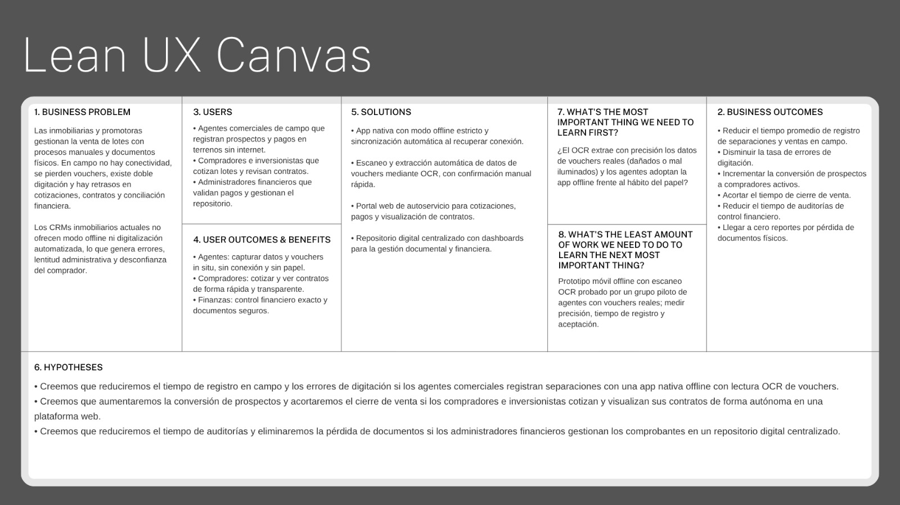

# Objetivos SMART

# Capítulo I: Presentación

---

## 1.1. Startup Profile

---

### 1.1.1. Descripción de la Startup
NovaCorp es una startup tecnológica emergente enfocada en la modernización del sector inmobiliario a través de soluciones de software. Nuestro propósito es optimizar la comercialización, gestión documental y control financiero de lotes mediante herramientas multiplataforma innovadoras, escalables y centradas en el usuario.

| Atributo | Declaración Estratégica |
| :--- | :--- |
| **Misión** | Empoderar a los agentes comerciales y empresas inmobiliarias en la gestión de sus ventas mediante el desarrollo de aplicaciones inteligentes que faciliten el registro in situ, la digitalización documental y el seguimiento eficiente de cotizaciones. |
| **Visión** | Ser la *startup* líder en la región en la creación de ecosistemas digitales para el sector inmobiliario, transformando la manera en que la tecnología elimina la fricción operativa y conecta a inversionistas con oportunidades de forma transparente. |

### 1.1.2. Perfiles de integrantes del equipo

| **Nombre y Apellido** | Caisahuana Osores, Becker Junior - U202419462 |                                                                                                                                                                     
|:----------------------|:-----------------------------------------|
| **Descripcion**       | Especialista en el modelado, manejo y estructuración de la información. Su labor consiste en diseñar el esquema de persistencia de datos y apoyar en el desarrollo de los servicios internos, garantizando que los registros del sistema se almacenen de forma segura y eficiente.                                   |
| **Foto**              |

| **Nombre y Apellido** | Capillo Lema, Mía Valentina - U20241C101 |                                                                                                                                                                     
|:----------------------|:---------------------------------------------|
| **Descripcion**       | Responsable de conceptualizar y construir la experiencia visual de la plataforma. Su principal objetivo es asegurar que la aplicación sea intuitiva, atractiva y, sobre todo, que cumpla con los estándares de accesibilidad e inclusión necesarios para llegar a todo tipo de usuarios.                                 |
| **Foto**              |

| **Nombre y Apellido** | Nuñez Soto, Andy Arturo - U20231E795 |                                                                                                                                                                     
|:----------------------|:-----------------------------------------|
| **Descripcion**       | Lidera la construcción de la interfaz interactiva con la que operará el usuario final. Su misión es transformar los diseños visuales en componentes completamente funcionales, asegurando un rendimiento fluido y una comunicación estable entre la pantalla del cliente y los servicios del servidor.                                   |
| **Foto**              |  |

| **Nombre y Apellido** | Perez Encarnacion, Breithner Rodolfo - U202418577 |                                                                                                                                                                     
|:----------------------|:-----------------------------------------|
| **Descripcion**       | Responsable de velar por la calidad del producto final y la organización del control de versiones. Se encarga de supervisar que el código cumpla con las convenciones establecidas por el equipo y de coordinar la publicación y el despliegue de la aplicación en los entornos correspondientes.                                   |
| **Foto**              |

| **Nombre y Apellido** | Rocca Mariaca, Angel Mathias - U20231E515 |                                                                                                                                                                     
|:----------------------|:-----------------------------------------|
| **Descripcion**       | Encargado de diseñar la arquitectura base del sistema y definir las estrategias tecnológicas del proyecto. Su enfoque está en estructurar una solución sólida y escalable, además de gestionar la integración del OCR que potenciará la lógica central de la plataforma para la validación de vouchers.                                   |
| **Foto**              |

---

## 1.2. Solution Profile

---

### 1.2.1. Antecedentes y problemática
En la actualidad, la comercialización y gestión de lotes representa uno de los desafíos más críticos para las agencias inmobiliarias y promotoras. La necesidad de capturar datos de prospectos y registrar pagos de separación directamente en el campo a menudo colisiona con la falta de conectividad a internet en zonas de nuevos desarrollos. Esto obliga a los agentes comerciales a depender de procesos manuales, generando una alta incidencia de errores humanos, pérdida de vouchers físicos y retrasos significativos en la actualización de la información.

Si bien existen soluciones de software CRM en el mercado, la mayoría carecen de capacidades operativas offline y no resuelven la fricción del manejo de documentos físicos, resultando en lentitud administrativa. Frente a este escenario, se propone el desarrollo de **inmoNode**, una plataforma inteligente que integra captura de datos sin conexión y validación de vouchers mediante tecnología OCR (Reconocimiento Óptico de Caracteres) para ofrecer control financiero automatizado y un repositorio digital centralizado.

Para delimitar y comprender a profundidad el alcance de esta problemática, se emplea el marco de análisis **5W2H**:

* **Who (Quién):** Agentes comerciales de campo, analistas financieros de empresas inmobiliarias, e inversionistas o compradores que buscan una experiencia de cotización transparente.
* **What (Qué):** Ineficiencias operativas causadas por la gestión manual de documentos físicos, la incapacidad de registrar pagos in situ sin internet, y la falta de visibilidad en tiempo real del estado de los contratos y cotizaciones.
* **Where (Dónde):** En terrenos de desarrollo inmobiliario, zonas periféricas con baja cobertura de red, y oficinas administrativas de agencias de bienes raíces en el Perú y la región latinoamericana.
* **When (Cuándo):** Durante todo el ciclo de venta del lote, presentándose los mayores obstáculos en el momento de la prospección, el registro del pago de separación en campo, y la posterior conciliación financiera en la oficina.
* **Why (Por qué):** Debido a que el uso de papel es propenso a deterioro y pérdida, la falta de señal móvil impide el uso de sistemas en la nube en tiempo real, y los flujos manuales de digitalización de vouchers son lentos y propensos a la doble digitación.
* **How (Cómo):** El problema se manifiesta a través de cuellos de botella administrativos, demoras en la emisión de contratos y desconfianza por parte del comprador. Actualmente, los agentes lo mitigan tomando notas en papel que luego transcriben, lo que genera retrasos. Para resolver esto de forma efectiva, la integración de aplicaciones móviles con bases de datos locales y lectura automatizada (OCR) resulta fundamental, ya que la automatización de la gestión documental en campo reduce significativamente la fricción operativa y los errores de registro (Gartner, 2022, *The Future of Paperless Operations*).
* **How much (Cuánto):** La dependencia de archivos físicos y los procesos de doble digitación tienen un impacto financiero y operativo cuantificable. Se estima que las ineficiencias por el uso de documentos en papel y la doble entrada de datos pueden representar hasta una pérdida del 20% en la productividad administrativa de los equipos de ventas (McKinsey & Company, 2021, *Automation in Real Estate*). Asimismo, la lentitud en la respuesta y la falta de plataformas de autoservicio transparentes reducen las tasas de cierre de ventas, perdiendo un importante margen de prospectos digitales.

---

### 1.2.2. Lean UX Process

#### 1.2.2.1. Lean UX Problem Statements

Se elabora un único Problem Statement para todo el proyecto, considerando en él a los tres segmentos identificados.

**El estado actual de** la comercialización y gestión de lotes inmobiliarios **se ha enfocado principalmente en** procesos manuales y archivos físicos para los agentes comerciales de campo que operan con conectividad limitada, procesos de cotización y seguimiento de contratos lentos y opacos para los compradores e inversionistas, y la dependencia de vouchers y comprobantes físicos para el control financiero de las empresas inmobiliarias.

**Lo que los productos y servicios existentes no logran resolver es** que los CRMs inmobiliarios tradicionales del mercado carecen de capacidades operativas offline robustas y no integran digitalización automatizada de comprobantes, dejando sin resolver la fricción del manejo de documentos físicos y la falta de visibilidad en tiempo real del estado de contratos y pagos.

**Nuestro producto abordará esta brecha mediante** la oferta de **inmoNode**, una plataforma multiplataforma (app nativa con modo offline y portal web) que integra captura y validación de vouchers mediante tecnología OCR, sincronización automática de los registros de campo, y un repositorio digital centralizado para consolidar el control financiero y documental.

**Nuestro enfoque inicial será** los agentes comerciales de campo, los compradores e inversionistas, y las áreas de control financiero de las empresas inmobiliarias que participan en el ciclo de comercialización de lotes.

**Sabremos que tuvimos éxito cuando veamos** una reducción significativa en el tiempo de registro de separaciones y ventas en campo, un incremento en la tasa de conversión de prospectos a compradores activos, y una disminución a cero en los reportes de pérdida de documentos y comprobantes físicos durante las auditorías de control financiero.

#### 1.2.2.2. Lean UX Assumptions

**Business Assumptions:**

- Nuestros clientes iniciales serán agencias de bienes raíces, promotoras de proyectos inmobiliarios, inversionistas y los agentes comerciales.

- Vamos a obtener la mayoría de los clientes mediante demostraciones directas del software a empresas inmobiliarias (B2B) y alianzas estratégicas con promotoras de lotes.

- Vamos a obtener ingresos mediante licencias de software SaaS, suscripciones escalonadas según el número de agentes o cobro por volumen de documentos procesados con OCR.

- Nuestra competencia en el mercado serán los CRMs inmobiliarios tradicionales que carecen de flujos offline robustos o que no integran digitalización automatizada nativa.

- Vamos a tener ventaja frente a nuestra competencia debido a la captura in situ sin conexión y la eliminación inmediata de la fricción física mediante inteligencia artificial (OCR).

- El mayor riesgo del servicio es la resistencia al cambio por parte de los agentes acostumbrados al papel, así como posibles fallos del OCR ante vouchers dañados, ilegibles o mal iluminados; lo resolveremos diseñando interfaces móviles altamente intuitivas, integrando flujos de confirmación manual rápida para los escaneos y realizando capacitaciones prácticas.

**Business Outcome Assumptions:**

- Reduciremos en al menos 80% el uso de papel físico en el ciclo de comercialización y gestión de lotes durante el primer año de operación.

- Incrementaremos la tasa de conversión de prospectos a compradores activos al reducir el tiempo de respuesta en cotizaciones y separaciones.

- Reduciremos el costo de adquisición de agencias inmobiliarias al demostrar un ahorro operativo medible frente a sus procesos manuales actuales.

- Disminuiremos a cero los reportes de pérdida de documentos físicos y comprobantes de pago en las auditorías de control financiero.

**User Assumptions:**

- Los usuarios son agentes comerciales de campo que necesitan capturar datos en terrenos sin conexión a internet.

- Los usuarios también son inversionistas y compradores que buscan cotizar lotes y revisar sus contratos de forma autónoma.

- Nuestro producto debe resolver la lentitud en la emisión de cotizaciones, el deterioro o pérdida de vouchers físicos, y la imposibilidad de registrar información comercial en zonas sin cobertura de red.

- El producto encaja como la herramienta de campo diaria e indispensable para los agentes de ventas, y como un portal de autoservicio confiable para que compradores e inversionistas gestionen y visualicen su patrimonio.

- El producto se utiliza en el momento exacto de la prospección, separación y cierre de venta directamente en el terreno (App), y en cualquier momento desde una computadora o móvil para revisar estados de cuenta, pagos y contratos (Web).

**User Outcome and Benefit Assumptions:**

- El valor más importante que un agente comercial obtiene es la agilidad para registrar ventas en campo y la eliminación total del papeleo físico en sus transacciones.

- El comprador e inversionista obtendrá control financiero exacto sobre sus pagos, inmediatez en el registro de su separación, y mayor seguridad documental sobre su inversión.

- Los agentes comerciales necesitan percibir la aplicación como extremadamente ágil y estable, con retroalimentación clara sobre el estado de sincronización (offline/online) durante la captura con cámara.

**Feature Assumptions:**

- Estas necesidades se pueden satisfacer con un ecosistema multiplataforma (Web y App nativa) que automatice la lectura de comprobantes vía OCR y centralice los contratos.

- Un modo offline estricto en la app móvil, con base de datos local, permitirá el registro continuo de prospección y separación de lotes sin conexión a internet.

- El escaneo y extracción automática de datos de vouchers mediante OCR reducirá los errores de digitación en el registro de pagos.

- La sincronización automática al recuperar la conexión a internet asegurará que los registros capturados en campo lleguen sin pérdidas a la oficina central.

- Un repositorio digital centralizado con acceso web permitirá a los compradores e inversionistas cotizar lotes y revisar el estado de sus contratos de forma autónoma.

#### 1.2.2.3. Lean UX Hypothesis Statements

Se elabora un Hypothesis Statement por cada Feature Assumption identificada.

**Creemos que lograremos** reducir en al menos 80% el uso de papel físico en el ciclo de comercialización y gestión de lotes durante el primer año **si** los Agentes Comerciales de Campo y los Compradores e Inversionistas **obtienen** eliminar su dependencia de documentos físicos en el proceso de venta **con** un ecosistema multiplataforma (Web y App nativa) que automatice la lectura de comprobantes vía OCR y centralice los contratos.

**Creemos que lograremos** incrementar la tasa de conversión de prospectos a compradores activos **si** los Agentes Comerciales de Campo **obtienen** registrar prospectos y separar lotes sin depender de la conectividad, reduciendo el tiempo de registro en campo **con** un modo offline estricto en la app móvil, con base de datos local.

**Creemos que lograremos** disminuir a cero los reportes de pérdida de comprobantes de pago en las auditorías de control financiero **si** los Agentes Comerciales de Campo **obtienen** eliminar los errores de digitación y contar con evidencia digital inmediata del pago **con** el escaneo y extracción automática de datos de vouchers mediante OCR.

**Creemos que lograremos** reducir el costo de adquisición de agencias inmobiliarias al demostrar un ahorro operativo medible frente a sus procesos manuales **si** los Agentes Comerciales de Campo **obtienen** que sus registros capturados en campo lleguen sin pérdidas a la oficina central apenas recuperen conexión **con** una sincronización automática que se ejecuta al recuperar la conexión a internet.

**Creemos que lograremos** incrementar la tasa de conversión de prospectos a compradores activos **si** los Compradores e Inversionistas **obtienen** cotizar lotes y revisar el estado de sus contratos de forma autónoma y transparente **con** un repositorio digital centralizado de acceso web.

#### 1.2.2.4. Lean UX Canvas

## 1.3. Segmentos objetivo

---

### Segmento 1: Agentes Comerciales de Campo

#### Descripción general:
Se refiere a los asesores de ventas encargados de la prospección, separación y venta in situ de los lotes, quienes enfrentan dificultades para registrar comprobantes y contratos en zonas de expansión urbana con nula o baja conectividad.

#### Perfil Operativo:
Incluye a profesionales de ventas y ejecutivos comerciales de entre 25 y 50 años que se desplazan constantemente a proyectos inmobiliarios ubicados en áreas periféricas.

#### Datos del sector:
En el proceso de expansión inmobiliaria hacia las afueras de las ciudades, la falta de infraestructura de telecomunicaciones es un obstáculo frecuente. La dependencia de registros físicos y la posterior digitación manual en la oficina ralentiza el ciclo de venta y aumenta la probabilidad de extravío de vouchers hasta en un 20% durante el traslado.

#### Necesidad:
Este segmento necesita una aplicación nativa que funcione de manera offline y que integre tecnología OCR para capturar vouchers y documentos en tiempo real, eliminando el manejo de papel y sincronizando los datos automáticamente al recuperar la conexión.

### Segmento 2: Compradores e Inversionistas

#### Descripción general:
Se refiere a personas naturales o jurídicas interesadas en adquirir lotes, ya sea para vivienda o rentabilidad, pero que experimentan procesos opacos, lentos y con falta de seguimiento claro sobre sus estados de cuenta y documentos legales.

#### Perfil Operativo:
Incluye a jóvenes profesionales, familias y empresarios de entre 28 y 60 años con capacidad de ahorro, inversión o acceso a crédito.

#### Datos del sector:
Según reportes del sector inmobiliario (como los de la Asociación de Empresas Inmobiliarias del Perú - ASEI), la confianza del consumidor es el factor más crítico en la compra de lotes en planos o terrenos, debido al temor constante a las estafas o informalidad documental. La falta de acceso transparente al estado legal y financiero de su lote frena la decisión de compra.

#### Necesidad:
Este segmento necesita una plataforma web intuitiva y de autoservicio que les permita cotizar lotes, visualizar sus contratos digitalizados y monitorear sus pagos de manera transparente para asegurar la confianza en su inversión.
