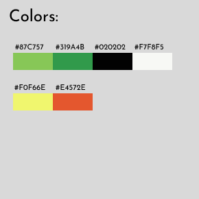
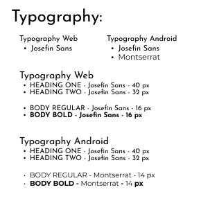
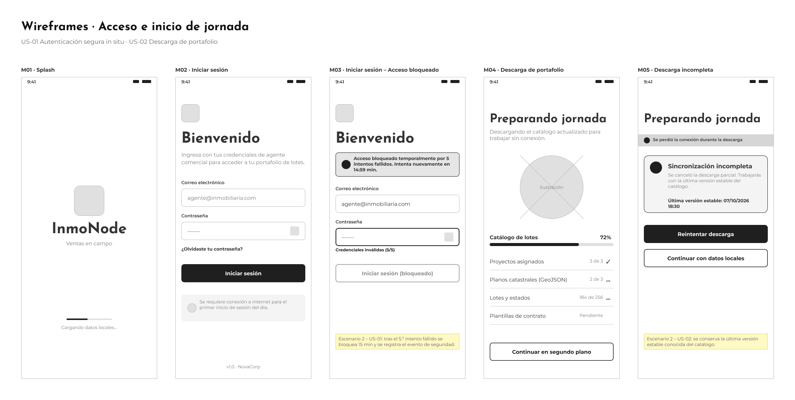
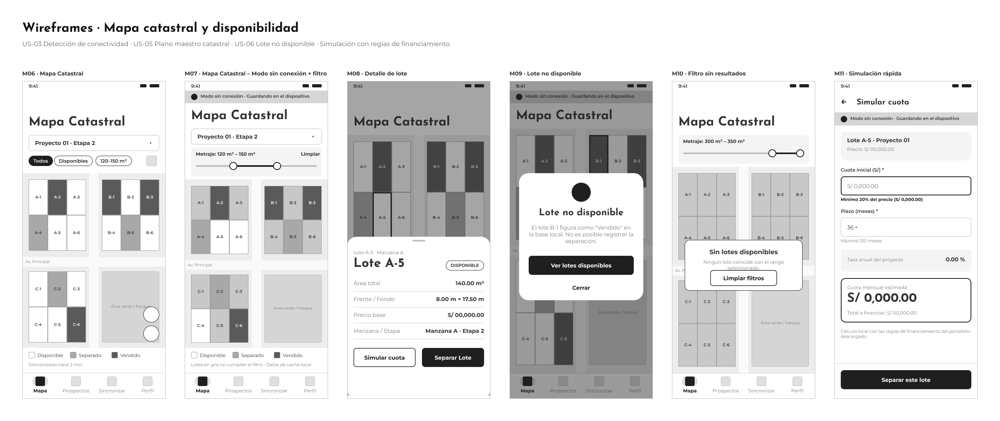
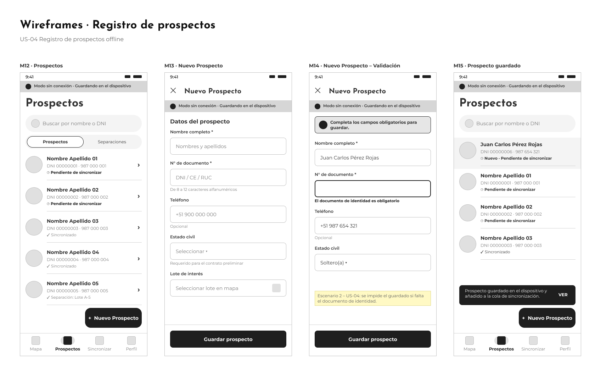
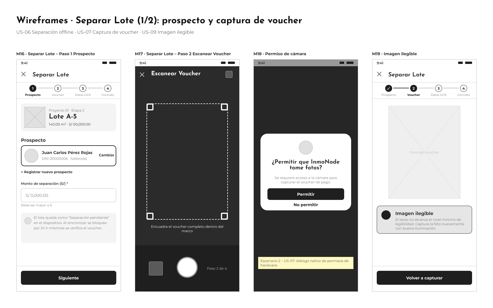
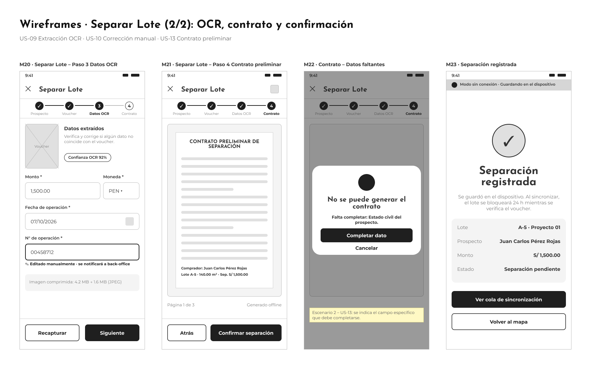
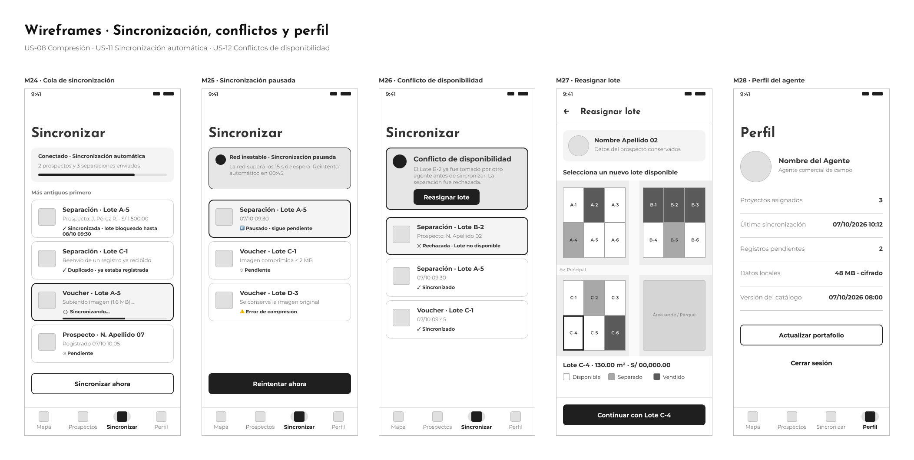
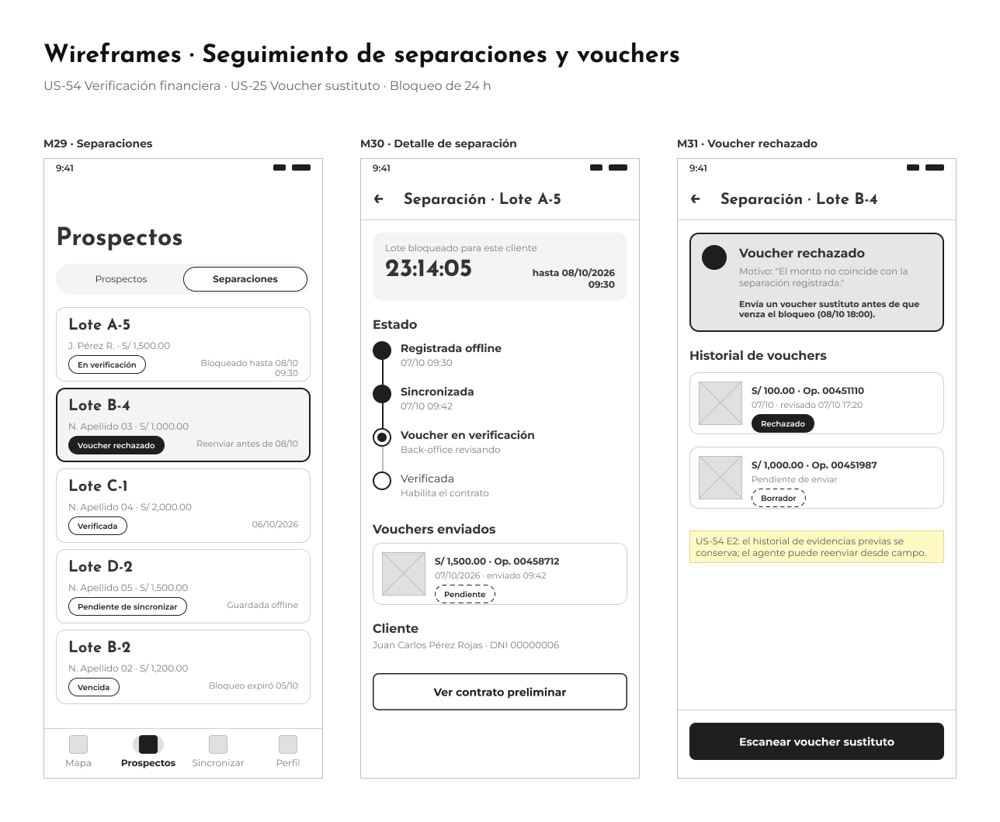

# Capítulo III: Solution UI/UX Design

## 3.1. Product design

### 3.1.1. Style Guidelines

A continuación se presentan los styles guidelines, los cuales contemplan fuentes tipográficas, componentes gráficos y reglas visuales, con el objetivo de mantener una presentación consistente, coherente y enfocada en la usabilidad en todos los productos digitales del ecosistema **InmoNode**.

#### 3.1.1.1. General Style Guidelines

#### Branding y Tono de Comunicación
La [Figura 3.1](#figura-3-1) identifica el isotipo y logotipo corporativo de InmoNode. La [Figura 3.2](#figura-3-2) identifica las dimensiones del tono de comunicación y lenguaje aplicado en las plataformas.

  
**Figura 3.1**  
*Branding oficial de InmoNode*

  
**Figura 3.2**  
*Tono de comunicación y lenguaje aplicado*

* **Branding:** La identidad visual combina una mapa dividida en lotes con un puntero de ubicación. Las capas lineales inferiores simbolizan la infraestructura en varios niveles, mientras que las tonalidades verdes de los bloques representan el estado de disponibilidad y el crecimiento patrimonial de los proyectos.
* **Language (Serio - Formal):** Al tratarse de contratos legales y seguimiento de cuotas, el lenguaje utilizado es técnico, preciso y profesional. Se eliminan la ambigüedad y los modismos, priorizando la claridad conceptual en las etiquetas del sistema (como "Estado de Cuenta", "Mis Contratos", "Separar Lote" o "Escanear Voucher").

#### Paleta de Colores (Colors)
La [Figura 3.3](#figura-3-3) identifica la paleta de colores corporativa. La [Tabla 3.1](#tabla-3-1) permite comparar los códigos hexadecimales, roles y la justificación de uso en la interfaz.

  
**Figura 3.3**  
*Paleta de colores oficial de InmoNode*

##### Tabla 3.1
*Especificación de la Paleta de Colores de InmoNode*

| Nombre / Tono | Código Hex | Rol en el Sistema | Justificación y Aplicación |
| :--- | :--- | :--- | :--- |
| **Verde Claro (Light Green)** | `#87C757` | Color Secundario / Acento | Representa frescura, dinamismo y la disponibilidad de lotes. Se aplica en etiquetas de estado "Disponible", botones secundarios y elementos destacados de la app móvil. |
| **Verde Inmobiliario (Forest Green)** | `#319A4B` | Color Primario | Color institucional principal. Transmite crecimiento, seguridad y patrimonio. Utilizado en botones de acción principal (CTA), como "Separar Lote", "Sincronizar" y en el isotipo de la marca. |
| **Negro Puro (Dark Black)** | `#020202` | Color de Estructura y Texto | Aporta contraste máximo, firmeza y elegancia. Utilizado en barras de navegación, encabezados (H1, H2) y textos de alta prioridad en ambas plataformas. |
| **Blanco Claro (Off-White)** | `#F7F8F5` | Color de Fondo / Superficie | Fondo suave que reduce la fatiga visual en jornadas de trabajo prolongadas. Se utiliza como contenedor base para tarjetas del catálogo, formularios y módulos web. |
| **Amarillo Alerta (Yellow Alert)** | `#F0F66E` | Estado de Advertencia | Diseñado para llamar la atención sin transmitir error crítico. Se utiliza en el banner de "Modo sin conexión", alertas de cuotas próximas a vencer y estado "En espera de verificación". |
| **Naranja Terracota (Terracotta)** | `#E4572E` | Estado de Ocupado / Error | Aporta visibilidad inmediata sobre restricciones. Utilizado para marcar lotes "Vendidos" o "Bloqueados" en el mapa catastral, cuotas vencidas y errores de sincronización OCR. |

#### Tipografía (Typography)
La [Figura 3.4](#figura-3-4) identifica la especificación tipográfica adoptada para la Plataforma Web y la Aplicación Móvil (Android).

  
**Figura 3.4**  
*Reglas tipográficas para Web y Android*

* **Plataforma Web (Josefin Sans):** Se utiliza la fuente **Josefin Sans** para la jerarquía completa de la versión Web.
  * **Heading One:** Josefin Sans - 40 px. Títulos de secciones principales, portadas de proyectos y contadores del Dashboard.
  * **Heading Two:** Josefin Sans - 32 px. Títulos de módulos como "Estado de Cuenta", "Mis Contratos" y "Simulador".
  * **Body Regular / Bold:** Josefin Sans - 16 px. Párrafos, tablas de amortización, cláusulas de contratos y descripciones del catálogo.
* **Aplicación Móvil Android (Josefin Sans & Montserrat):** Combina la elegancia de Josefin Sans en encabezados con la alta legibilidad en pantallas pequeñas de Montserrat en cuerpos de texto.
  * **Heading One:** Josefin Sans - 40 px.
  * **Heading Two:** Josefin Sans - 32 px.
  * **Body Regular / Bold:** Montserrat - 14 px. Diseñada para formularios de registro in situ de prospectos, tarjetas de la cola de sincronización y datos extraídos por el motor OCR.

#### Espaciado y Retícula (Spacing)
La [Figura 3.5](#figura-3-5) identifica la unidad base de espaciado implementada en los componentes del sistema.

  
**Figura 3.5**  
*Unidad base de espaciado (8 px)*

* **Grid System (8 px):** Todo el diseño de componentes, *paddings*, márgenes y áreas táctiles se calcula en múltiplos de **8 px** (8px, 16px, 24px, 32px, 48px). Esto garantiza que los botones e insumos interactivos en la App Móvil cumplan con las dimensiones mínimas de accesibilidad táctil para el trabajo del agente en terreno.

---

### 3.1.2. Information Architecture

#### 3.1.2.1. Organization Systems

La organización del contenido en InmoNode se estructura para diferenciar claramente las herramientas operativas de campo de la aplicación móvil y el entorno de autoservicio de la plataforma web, garantizando que cada perfil (agente comercial, comprador/inversionista) encuentre la información de manera eficiente.

**Plataforma Web**

Se aplica principalmente una **categorización según audiencia** y una **organización por tópicos** para separar el contenido público (Landing Page) del contenido privado (Dashboard del cliente):
*   **Organización Jerárquica (Visual Hierarchy):** En el Landing Page y portal público, la información fluye desde la propuesta de valor de la inmobiliaria hasta el catálogo de proyectos. El orden prioriza: Catálogo de proyectos -> Detalles del terreno -> Simulador de financiamiento.
*   **Organización por Tópicos:** Dentro del perfil privado del comprador, la información se agrupa en módulos temáticos específicos: Estado de Cuenta, Mis Contratos y Mis Pagos.

**Aplicación Móvil**
Dentro de la aplicación nativa orientada a la operatividad sin conexión a internet, se utilizan sistemas especializados:
*   **Organización Secuencial:** Se aplica estrictamente en los flujos críticos de ventas en campo, guiando al agente paso a paso: Selección de lote en mapa -> Registro de datos del prospecto -> Captura fotográfica de voucher -> Extracción de datos vía OCR -> Confirmación de separación.
*   **Organización Matricial / Espacial:** Empleada en la visualización del plano maestro catastral, donde los lotes se distribuyen geográficamente y se distinguen por su estado (disponible o vendido).
*   **Categorización Cronológica:** Utilizada para la cola de sincronización de registros offline, ordenando las transacciones locales desde la más antigua hasta la más reciente para su envío a la nube cuando se recupera la conexión.

#### 3.1.2.2. Labelling Systems

Las etiquetas han sido estandarizadas para mantener un lenguaje ubicuo (Ubiquitous Language) del dominio inmobiliario, buscando simplicidad y evitando ambigüedades técnicas tanto para el comprador como para el vendedor de campo.

**Plataforma Web**
*   **Proyectos:** Catálogo general de los proyectos inmobiliarios disponibles.
*   **Simulador:** Herramienta para calcular cuotas, plazos y tasas de interés.
*   **Estado de Cuenta:** Panel financiero con el histórico de recibos, deuda restante y avance de pagos.
*   **Mis Pagos:** Repositorio histórico de comprobantes y vouchers validados.
*   **Mis Contratos:** Repositorio para previsualizar, aceptar y descargar documentos legales.
*   **Certificado de No Adeudo:** Documento emitido al cancelar el 100% del lote.

**Aplicación Móvil**
*   **Mapa Catastral:** Plano interactivo georreferenciado de los lotes.
*   **Nuevo Prospecto:** Formulario para registrar potenciales clientes in situ.
*   **Separar Lote:** Acción para bloquear temporalmente la disponibilidad de un terreno.
*   **Escanear Voucher:** Activación de la cámara y el motor OCR para leer comprobantes.
*   **Modo Offline:** Indicador visual de pérdida de red y trabajo local.
*   **Sincronizar:** Envío de transacciones locales a la base central en la nube.

#### 3.1.2.3. SEO Tags and Meta Tags

**Plataforma Web**
*   **Title:** InmoNode: Plataforma de Gestión Inmobiliaria y Venta de Lotes.
*   **Description:** Cotiza, simula tu financiamiento y gestiona la compra de tu lote con total transparencia. Accede a tus contratos y estado de cuenta inmobiliario 24/7.
*   **Keywords:** compra de lotes, proyectos inmobiliarios, simulación de crédito inmobiliario, terrenos, InmoNode, NovaCorp.
*   **Author:** NovaCorp

**Aplicación Móvil**
*   **App Title:** InmoNode App - Ventas en Campo.
*   **App Subtitle:** CRM Inmobiliario Offline y OCR.
*   **App Description:** Herramienta indispensable para agentes comerciales. Registra prospectos, separa lotes en el mapa interactivo y escanea vouchers de pago sin necesidad de conexión a internet.
*   **App Keywords:** crm offline, ventas inmobiliarias, escaner vouchers OCR, proptech, agentes de campo.

#### 3.1.2.4. Searching Systems

Para manejar eficientemente el catálogo de lotes y los flujos financieros, se implementan herramientas de búsqueda visuales y dinámicas:

*   **Filtros Geométricos y Visuales (Web y App):** Los usuarios pueden filtrar los lotes en el mapa interactivo estableciendo rangos de metraje (ej. 120m2 a 150m2). El sistema recalcula los polígonos y aísla visualmente solo los lotes que cumplen los parámetros.
*   **Búsqueda por Estados en Mapa:** Los resultados de búsqueda se representan directamente en el plano catastral mediante colores, indicando visualmente si un lote está "Disponible", "Separado" o "Vendido" (bloqueados en color gris cuando no hay stock).
*   **Filtros Financieros (Web):** El comprador puede buscar dentro de su historial en la sección "Mis Pagos", filtrando vouchers por su estado administrativo ("Aprobado" o "Rechazado").
*   **Indicadores de Falta de Resultados:** Si los filtros aplicados por el usuario web no coinciden con ningún lote, el mapa muestra los lotes inactivos y despliega un mensaje claro indicando la ausencia de stock.

#### 3.1.2.5. Navigation Systems

El sistema de navegación está diseñado para ser altamente resiliente en campo y transparente para el comprador:

*   **Navegación Persistente (Bottom Navigation en Móvil):** En la aplicación para agentes, se prioriza un menú inferior para acceso rápido a las tareas de mayor frecuencia: Mapa Catastral, Registro de Prospectos y Cola de Sincronización.
*   **Navegación Contextual (Indicadores de Estado):** La aplicación móvil cuenta con un "Listener de red". Cuando se pierde la conexión, la navegación se adapta mostrando un banner persistente de "Modo sin conexión" para darle seguridad al agente de que puede seguir operando en la caché local.
*   **Navegación de Flujo (Wizard):** Para reducir la curva de aprendizaje y los errores operativos (como omitir fotos de DNI o datos), el proceso de *Separación de Lote* guía al agente pantalla por pantalla de forma obligatoria hasta la extracción del OCR.
*   **Menú Lateral (Dashboard Web):** Para el comprador, la plataforma web ofrece una barra de navegación estructurada (Sidebar) que le permite saltar fácilmente entre el Simulador de Financiamiento, su Estado de Cuenta y sus Contratos, dándole completa autonomía.

### 3.1.3. Landing Page UI Design

#### 3.1.3.1. Landing Page Wireframe

#### 3.1.3.2. Landing Page Mock-up

### 3.1.4. Mobile Applications UX/UI Design

En esta sección se presenta el diseño de experiencia e interfaz de **InmoNode App - Ventas en Campo**, la aplicación nativa para Android dirigida al segmento de *Agentes Comerciales de Campo* (User Persona: Azbel Capillo). El diseño se elaboró en **Figma** sobre un lienzo de 360 × 800 dp y se deriva de las historias de usuario de las épicas **EP-01 (Gestión Operativa In Situ)** y **EP-02 (Captura y Digitalización Documental)**, así como de los recursos REST que el backend expone para el rol `FIELD_AGENT` (sincronización de campo, portafolio offline y registro de vouchers).

#### 3.1.4.1. Mobile Applications Wireframes

Los wireframes representan la estructura de cada pantalla en baja fidelidad (escala de grises), sin aplicar todavía la paleta corporativa, con el fin de validar la jerarquía de contenido, los flujos y los estados de error antes del diseño visual. Todos los componentes respetan las *Style Guidelines* de la sección 3.1.1: retícula base de **8 px**, títulos en **Josefin Sans** (40 px y 32 px) y textos en **Montserrat 14 px**. Se reutilizan los mismos componentes de navegación definidos en la sección 3.1.2.5: barra de navegación inferior (Mapa, Prospectos, Sincronizar y Perfil), banner persistente de **"Modo sin conexión"** y un *wizard* de cuatro pasos para **Separar Lote**. Las notas amarillas indican el escenario Gherkin de la historia de usuario que representa la pantalla.

**Enlace al archivo de Figma:** [InmoNode – Wireframes (página *Mobile App Wireframes*)](https://www.figma.com/design/6OrCU2GtWZCuuiH5qCd4HX/InmoNode-%E2%80%93-Wireframes)

La [Tabla 3.2](#tabla-3-2) permite relacionar cada pantalla con las historias de usuario que atiende y con el recurso del backend que la alimenta.

##### Tabla 3.2
*Trazabilidad de los wireframes de la aplicación móvil*

| ID | Pantalla | User Stories | Recurso del backend |
| :--- | :--- | :--- | :--- |
| M01 | Splash | US-02 | Base de datos local (SQLite) |
| M02 | Iniciar sesión | US-01 | `POST /api/v1/auth/login` |
| M03 | Iniciar sesión – Acceso bloqueado | US-01 (Escenario 2) | `POST /api/v1/auth/login` |
| M04 | Descarga de portafolio | US-02 | `GET /api/v1/field-sync/portfolio` |
| M05 | Descarga incompleta | US-02 (Escenario 2) | `GET /api/v1/field-sync/portfolio` |
| M06 | Mapa Catastral | US-05 | Lotes GeoJSON del portafolio descargado |
| M07 | Mapa Catastral – Modo sin conexión y filtro | US-03, US-05 | Caché local |
| M08 | Detalle de lote | US-05 (Escenario 2) | Propiedades del lote: `code`, `area`, `front`, `depth`, `price` |
| M09 | Lote no disponible | US-06 (Escenario 2) | Caché local |
| M10 | Filtro sin resultados | Searching Systems (3.1.2.4) | Caché local |
| M11 | Simulación rápida | US-05 | `financingRules` del proyecto en el portafolio |
| M12 | Prospectos | US-04 | Base de datos local |
| M13 | Nuevo Prospecto | US-04 | `POST /api/v1/field-sync` (`prospects`) |
| M14 | Nuevo Prospecto – Validación | US-04 (Escenario 2) | Validación local del documento (8 a 12 caracteres) |
| M15 | Prospecto guardado | US-04, US-11 | Cola de sincronización local |
| M16 | Separar Lote – Paso 1: Prospecto | US-06 | `POST /api/v1/field-sync` (`reservations`) |
| M17 | Separar Lote – Paso 2: Escanear Voucher | US-07 | Cámara del dispositivo |
| M18 | Permiso de cámara | US-07 (Escenario 2) | Diálogo nativo de permisos |
| M19 | Imagen ilegible | US-09 (Escenario 2) | Motor OCR en el dispositivo |
| M20 | Separar Lote – Paso 3: Datos OCR | US-08, US-09, US-10 | `POST /api/v1/vouchers/upload-url` y `POST /api/v1/vouchers` |
| M21 | Separar Lote – Paso 4: Contrato preliminar | US-13 | Plantilla PDF local |
| M22 | Contrato – Datos faltantes | US-13 (Escenario 2) | Validación local |
| M23 | Separación registrada | US-06 | Cola de sincronización local |
| M24 | Cola de sincronización | US-08, US-11 | `POST /api/v1/field-sync` (resultados `SYNCED` y `DUPLICATE`) |
| M25 | Sincronización pausada | US-08 (Escenario 2), US-11 (Escenario 2) | Reintento automático |
| M26 | Conflicto de disponibilidad | US-12 | `POST /api/v1/field-sync` (resultado `CONFLICT` y `conflictReason`) |
| M27 | Reasignar lote | US-12 (Escenario 2) | `POST /api/v1/field-sync` |
| M28 | Perfil del agente | US-01, US-02 | `POST /api/v1/auth/logout` |
| M29 | Separaciones | US-54 | `GET /api/v1/reservations/{transactionId}/payment-evidences` |
| M30 | Detalle de separación | US-54 | `GET /api/v1/reservations/{transactionId}/payment-evidences` |
| M31 | Voucher rechazado | US-25, US-54 (Escenario 2) | `GET .../payment-evidences` y `POST /api/v1/vouchers` |

**Acceso e inicio de jornada**

La [Figura 3.6](#figura-3-6) presenta el ingreso del agente a la aplicación. El inicio de sesión utiliza el correo electrónico y la contraseña del agente; tras cinco intentos fallidos el acceso se bloquea durante 15 minutos. Una vez autenticado, la aplicación descarga el portafolio de proyectos, lotes y reglas de financiamiento para trabajar sin conexión; si la red se interrumpe durante la descarga, se conserva la última versión estable del catálogo.

  
**Figura 3.6**  
*Wireframes de acceso e inicio de jornada (M01–M05)*

**Mapa catastral y disponibilidad**

La [Figura 3.7](#figura-3-7) presenta el plano maestro del proyecto, renderizado desde la caché local. Los lotes se distinguen por estado (Disponible, Separado o Vendido) y pueden filtrarse por rango de metraje; cuando ningún lote cumple el filtro, el mapa los muestra inactivos y despliega un mensaje de ausencia de stock. Al seleccionar un lote se muestran su área, frente, fondo y precio base, junto con las acciones **Simular cuota**, que calcula la cuota con las reglas de financiamiento del proyecto, y **Separar Lote**.

  
**Figura 3.7**  
*Wireframes del mapa catastral y la disponibilidad de lotes (M06–M11)*

**Registro de prospectos**

La [Figura 3.8](#figura-3-8) presenta el registro de prospectos sin conexión. El formulario solicita el nombre completo y el documento de identidad como datos obligatorios; el teléfono es opcional y el estado civil se requiere únicamente para generar el contrato preliminar. Cada registro se guarda en el dispositivo y se añade a la cola de sincronización.

  
**Figura 3.8**  
*Wireframes del registro de prospectos (M12–M15)*

**Separar Lote**

La [Figura 3.9](#figura-3-9) y la [Figura 3.10](#figura-3-10) presentan el *wizard* de separación. En el primer paso se asocia el prospecto y el monto de separación; en el segundo se captura el voucher con la cámara, contemplando la solicitud de permisos y el rechazo de imágenes ilegibles. En el tercer paso el motor OCR completa el monto, la moneda, la fecha y el número de operación, mostrando su nivel de confianza; cualquier campo corregido manualmente queda marcado para el back-office. Finalmente, el agente previsualiza el contrato preliminar y confirma la separación, que queda pendiente de sincronizar.

  
**Figura 3.9**  
*Wireframes de Separar Lote: prospecto y captura del voucher (M16–M19)*

  
**Figura 3.10**  
*Wireframes de Separar Lote: datos OCR, contrato preliminar y confirmación (M20–M23)*

**Sincronización y conflictos**

La [Figura 3.11](#figura-3-11) presenta la cola de sincronización ordenada cronológicamente. Al recuperar la conexión, cada registro se envía al servidor y muestra su resultado: sincronizado (con la hora hasta la que el lote queda bloqueado), duplicado o en conflicto. Si la red es inestable, la transmisión se pausa y se reintenta automáticamente. Cuando otro actor tomó el lote antes de sincronizar, la aplicación conserva los datos del prospecto y permite reasignarle un nuevo lote disponible.

  
**Figura 3.11**  
*Wireframes de sincronización, conflictos de disponibilidad y perfil (M24–M28)*

**Seguimiento de separaciones y vouchers**

La [Figura 3.12](#figura-3-12) presenta el seguimiento posterior a la sincronización. El agente consulta sus separaciones, el tiempo restante del bloqueo de 24 horas y el estado de verificación de cada voucher. Si el área administrativa rechaza un comprobante, se muestra el motivo, se conserva el historial de evidencias y se habilita el envío de un voucher sustituto desde campo.

  
**Figura 3.12**  
*Wireframes del seguimiento de separaciones y vouchers (M29–M31)*

#### 3.1.4.2. Mobile Applications Wireflow Diagrams

#### 3.1.4.3. Mobile Applications Mock-ups

#### 3.1.4.4. Mobile Applications User Flow Diagrams

#### 3.1.4.5. Mobile Applications Prototyping
