# Capítulo IV: Product Implementation & Validation

## 4. Product Implementation & Validation

La implementación de inmoNode, desarrollado por NovaCorp, comprende la Landing Page, los servicios RESTful, la aplicación Android para agentes comerciales y el frontend web para compradores y back-office. El trabajo se organiza por Sprints, relacionando las historias seleccionadas con evidencias de desarrollo, pruebas, documentación, despliegue y validación.

Los productos distribuyen las capacidades comerciales, documentales y financieras de los cuatro bounded contexts definidos en el diseño. Android concentra la operación en campo; el frontend web, el autoservicio y back-office; y los servicios RESTful, la consolidación e integración de información. La autenticación está especificada en las historias, sin que ello acredite su implementación.

Se selecciona ML Kit Text Recognition para el feature de aprendizaje autónomo asociado con US-47 y US-09. Se evaluará el reconocimiento local de vouchers y la interpretación de monto, fecha y código de operación, manteniendo revisión humana.

### 4.1. Software Configuration Management

En esta sección se establece decisiones comunes sobre entorno, organización del código, convenciones y despliegue.

#### 4.1.1. Software Development Environment Configuration

El equipo documenta Jira para la gestión de requisitos y Trello para el seguimiento del Sprint 1. La URL del tablero se registra en 4.2.1.3. El desarrollo utiliza Spring Boot, Angular y Android Studio con Kotlin y Jetpack Compose.

| Actividad | Herramienta | Propósito en el proyecto | URL oficial de referencia o descarga |
| :---: | :---: | :---: | :---: |
| Gestión y requisitos | Jira | Gestionar el Product Backlog y su selección por Sprint. | `https://www.atlassian.com/software/jira` |
| Seguimiento del Sprint | Trello | Registrar tareas y su evolución en To Do, In Process, To Review y Done. | Trello — `https://trello.com/` |
| Investigación UX | UXPressia | User Personas, mapas de empatía, recorridos e Impact Mapping | `https://uxpressia.com/` |
| Exploración del dominio | Miro | Big Picture EventStorming | `https://miro.com/` |
| Diseño UX/UI | Figma | Wireframes, mock-ups y prototipos | `https://www.figma.com/` |
| Flujos de interacción | Lucidchart u Overflow | Wireflows y User Flows | `https://www.lucidchart.com/` · `https://overflow.io/` |
| Arquitectura | Structurizr | Diagramas C4. Espacio | `https://structurizr.com/` |
| UML y diseño de datos | Lucidchart; Lucidchart o Vertabelo | Diagramas UML y base de datos | `https://www.lucidchart.com/` · `https://vertabelo.com/` |
| Desarrollo de Landing Page | HTML5, CSS3 y JavaScript | Sitio estático del modelo de negocio | `https://developer.mozilla.org/` |
| Desarrollo backend | Spring Boot | Servicios RESTful internos | `https://spring.io/projects/spring-boot` |
| Desarrollo frontend | Angular | Portal del comprador y back-office. | `https://angular.dev/` |
| Diseño y componentes web | Material Design / Angular Material | Referencia visual y biblioteca exigidas | `https://m3.material.io/` · `https://material.angular.dev/` |
| Desarrollo Android | Android Studio, Kotlin y Jetpack Compose | Aplicación nativa e interfaces | `https://developer.android.com/studio` · `https://kotlinlang.org/` · `https://developer.android.com/compose` |
| Aprendizaje autónomo | ML Kit Text Recognition | Reconocimiento local de texto de vouchers | `https://developers.google.com/ml-kit/vision/text-recognition/v2/android` |
| Pruebas | Gherkin | Especificaciones de aceptación y comprobación de comportamientos | `https://cucumber.io/docs/gherkin/reference/` |
| Pruebas backend | JUnit Jupiter, Mockito, Spring Boot Test y Testcontainers | Pruebas unitarias/MVC con colaboradores simulados e integración con PostgreSQL; la suite con contenedores requiere Docker. | `https://docs.spring.io/spring-boot/reference/testing/index.html` |
| Documentación de servicios | OpenAPI / Swagger | Contratos RESTful | `https://www.openapis.org/` · `https://swagger.io/` |
| Control de versiones | Git / GitHub | Historial y alojamiento del código | `https://git-scm.com/` · `https://github.com/` |
| Despliegue | AWS y Docker | Infraestructura del diseño | `https://aws.amazon.com/` · `https://www.docker.com/` |
| Documentación del informe | GitHub | Mantener el documento y sus versiones. | `https://git-scm.com/` · `https://github.com/` |

#### 4.1.2. Source Code Management

Git registra modificaciones; GitHub aloja repositorios y facilita colaboración. Los Web Services deben conservar código y pruebas unitarias e integración/aceptación.

| Producto | URL | Contenido relevante |
| :---: | ----- | :---: |
| Landing Page | `https://github.com/1ACC0238-2620-13981-NovaCorp-InmoNode/InmoNode-Landing-Page.git` | HTML, CSS, JavaScript y recursos. |
| Web Services | `https://github.com/1ACC0238-2620-13981-NovaCorp-InmoNode/InmoNode-Backend.git` | Spring Boot, configuración y pruebas requeridas |
| Android | `https://github.com/1ACC0238-2620-13981-NovaCorp-InmoNode/InmoNode-Mobile.git` | Kotlin/Compose, recursos y compilación. |
| Frontend web |  | Angular, vistas y consumo de servicios. |

| Rama | Propósito | Origen | Integración | Convención de nombre |
| :---: | :---: | :---: | :---: | :---: |
| main | Versiones preparadas para publicación | Inicialización | Recibe release y hotfix | main |
| develop | Integración del desarrollo | main | Recibe feature y correcciones | develop |
| feature | Una funcionalidad por rama | develop | develop | feature/\<story-id\>-\<short-description\> |
| release | Preparación de versión | develop | main y develop | release/\<MAJOR.MINOR.PATCH\> |
| hotfix | Corrección de versión publicada | main | main y develop | hotfix/\<MAJOR.MINOR.PATCH\> |

Si existe una release activa, el hotfix se incorpora también a ella y se conserva en develop al cerrarla.

Conventional Commits utiliza <type>[optional scope][!]: <description>. Ejemplos: feat(prospects): add offline prospect registration y fix(reservations): reject unavailable lots. Semantic Versioning utiliza MAJOR.MINOR.PATCH para cambios incompatibles, funcionalidades compatibles y correcciones compatibles, respectivamente.

#### 4.1.3. Source Code Style Guide & Conventions

La nomenclatura del código se mantendrá en inglés; los textos de interfaz podrán permanecer en español.

| Lenguaje | Guía de referencia | Convenciones principales propuestas |
| :---: | :---: | :---: |
| Kotlin | Kotlin Coding Conventions / Android Kotlin Style Guide | Clases e interfaces en UpperCamelCase; funciones y variables en lowerCamelCase; constantes en UPPER\_SNAKE\_CASE; paquetes en minúsculas y archivos descriptivos. Las funciones Compose de UI conservarán su convención específica. |
| Java | Google Java Style Guide | Clases e interfaces en UpperCamelCase; métodos y variables en lowerCamelCase; constantes en UPPER\_SNAKE\_CASE; paquetes en minúsculas y archivo con nombre de clase. |
| TypeScript | Google TypeScript Style Guide / Angular Style Guide | Clases e interfaces en UpperCamelCase; funciones y variables en lowerCamelCase; constantes globales en CONSTANT\_CASE; coherencia entre nombres de componentes, templates y estilos. |
| HTML y CSS | Google HTML/CSS Style Guide | HTML semántico, elementos en minúsculas, clases CSS descriptivas separadas por guiones y archivos en inglés. No aplican clases e interfaces como tipos de programación. |
| JavaScript | Google JavaScript Style Guide | Clases en UpperCamelCase; funciones y variables en lowerCamelCase; constantes globales en UPPER\_SNAKE\_CASE y archivos descriptivos. |
| Gherkin | Cucumber Gherkin Reference | Archivos, títulos y pasos descriptivos en inglés; precondición, acción y resultado separados mediante Given/When/Then; resultados observables y detalles irrelevantes excluidos. |

En Android, los bounded contexts presentes en la aplicación se organizarán en features/, con presentation, application, domain e infrastructure. Domain y Application contendrán Kotlin puro, sin SDK Android ni bibliotecas de persistencia/red. Las reglas residirán en Domain; ViewModels y estados, en Presentation; repositorios concretos y mappers, en Infrastructure. DTO y entidades de persistencia permanecerán aislados del dominio.

#### 4.1.4. Software Deployment Configuration

La configuración de despliegue de inmoNode toma como referencia el apartado 2.5.3.3 y su Figura 2.35. La arquitectura contempla Vercel para los productos web, Firebase App Distribution para distribuir el APK, Render para los Web Services y Supabase para datos y archivos. El backend cuenta con publicación documentada igualmente que los demás productos mantienen procedimientos.

| Producto | Configuración y procedimiento | Deployment |
|---|---|---|
| Landing Page | Repositorio `InmoNode-Landing-Page`, con HTML, CSS y JavaScript.  conectar el repositorio con Vercel, configurar la publicación y comprobar recursos y navegación. | Vercel |
| Web Services | Dockerfile multietapa con Maven/Temurin 21 y JRE 21. El servicio de Render está conectado a `main`. Se documenta el despliegue de `cac4444`, el arranque en el puerto `10000` y la comprobación de `GET /health`. | https://inmonode-backend.onrender.com |
| Aplicación Android | obtener el código, compilar el proyecto Kotlin/Compose, generar el APK, distribuirlo mediante Firebase App Distribution e instalarlo en un dispositivo físico para verificar el registro offline. | APK y dispositivo Android. |
| Frontend web | conectar el repositorio Angular con Vercel, configurar la compilación y la URL de la API, publicar y verificar la integración. | Vercel |

Los Web Services contemplan conexiones con PostgreSQL y Storage de Supabase, RabbitMQ de CloudAMQP y los servicios externos Culqi, DocuSign y Brevo. Caffeine y el consumidor de documentos PDF se ubican dentro del proceso del backend.

GitHub Actions documenta compilación y pruebas, mientras que Render tiene habilitado `Auto-Deploy: On Commit`.

##### Deployment Diagram de C4 Model

El diagrama muestra la distribución de los productos sobre los nodos de infraestructura: aplicación y base local en Android; productos web en Vercel; backend en Render; PostgreSQL y almacenamiento en Supabase; y broker en CloudAMQP. Firebase App Distribution corresponde al canal de distribución del APK. La figura representa la arquitectura de referencia.

*Diagrama de despliegue de inmoNode (servicios con plan gratuito)*

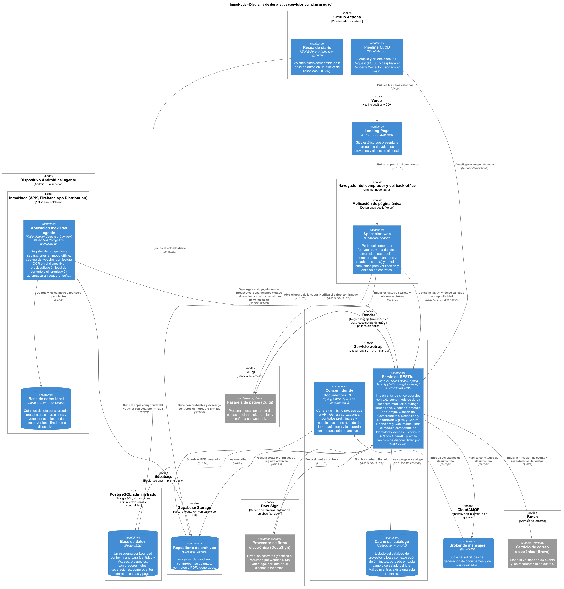

### 4.2. Landing Page & Mobile Application Implementation

La implementación se organiza desde el Product Backlog. Cada Sprint relaciona historias con desarrollo, pruebas, documentación y despliegue de Landing Page, aplicaciones y Web Services.

#### 4.2.1. Sprint 1

El Sprint 1 reúne alta de proyectos, registro de lotes, publicación del catálogo, presentación de inmoNode, exploración de proyectos y registro local de prospectos. Su valor es preparar una oferta inmobiliaria publicable y conservar oportunidades comerciales en campo sin conexión.

##### 4.2.1.1. Sprint Planning 1

La selección del Sprint 1 se alinea con el Product Backlog de feature/chapter-02: US-51, US-52, US-53, US-P01, US-15 y US-04, con 21 Story Points. Se toma Chapter II como referencia de asignación por Sprint; US-05 y US-06 quedan en Sprint 2.

| Campo | Contenido |
| :---: | :---: |
| Sprint \# | Sprint 1 |
| Sprint Planning Background | Alta/publicación de catálogo, Landing Page, exploración de proyectos y registro local de prospectos. |
| Date | 2026-10-05 |
| Time | 08:00 PM |
| Location | Reunión virtual |
| Prepared By | Perez Encarnacion, Breithner Rodolfo |
| Attendees (to planning meeting) | Caisahuana Osores, Becker Junior – Capillo Lema, Mía Valentina – Nuñez Soto, Andy Arturo – Rocca Mariaca, Angel Mathias |
| Sprint n – 1 Review Summary | Sprint 1 |
| Sprint n – 1 Retrospective Summary | Sprint 1 |
| Sprint Goal & User Stories | US-51, US-52, US-53, US-P01, US-15 y US-04. |
| Sprint 1 Goal | Preparar proyectos y lotes publicables para que compradores e inversionistas conozcan inmoNode y exploren su oferta, mientras los agentes registran prospectos sin conexión. Se comprobará con alta de proyecto Borrador, lote No publicado, publicación válida, Landing Page y catálogo navegables, y guardado local del prospecto con rechazo de documento ausente. |
| Sprint 1 Velocity | Capacidad planificada: 21 SP. |
| Sum of Story Points | 21 Story Points: 3 + 5 + 2 + 3 + 3 + 5. |

---
##### 4.2.1.2. Aspect Leaders and Collaborators

La Leadership-and-Collaboration Matrix (LACX) conserva la distribución actual del equipo. Los aspectos abarcan alta y publicación de catálogo (US-51/52/53), Landing Page (US-P01), exploración web (US-15), registro y persistencia móvil de prospectos (US-04), testing y deployment. L identifica al líder que coordina contratos, revisión y entrega; C identifica a los colaboradores.

| Team Member | GitHub Username        | Landing Page | Backend Bounded Contexts | Mobile App UI | Testing | Deployment |
| --- |------------------------| :---: |:------------------------:| :---: |:-------:| :---: |
| Caisahuana Osores, Becker Junior | becker693              | C |            L             | C |    C    | C |
| Capillo Lema, Mía Valentina | MiaCL-5 | C |            C             | C |    L    | C |
| Nuñez Soto, Andy Arturo | arturo-ns              | C |            C             | C |    C    | L |
| Perez Encarnacion, Breithner Rodolfo | Breithner1 | L |            C             | C |    C    | C |
| Rocca Mariaca, Angel Mathias | MRMpro13               | C |            C             | L |    C    | C |

Becker coordina backend; Mía, testing; Breithner, Landing Page y flujos web; Angel, Mobile App UI; y Andy, deployment. Las tareas se distribuyen según esta matriz. US-01, US-02 y US-14 son dependencias cuando corresponda; US-05/06 y el prototipo US-47 no se contabilizan como entregas del Sprint 1.

---
##### 4.2.1.3. Sprint Backlog 1

El backlog descompone las seis historias asignadas a Sprint 1 en Chapter II, feature/chapter-02, revisión 59512c4 — `https://github.com/1ACC0238-2620-13981-NovaCorp-InmoNode/InmoNode-Project-Report/blob/59512c463a940cbab67e020e7785d1e9b244e7fd/docs/Chapter-02.md`.  US-05 y US-06 pertenecen a Sprint 2. Las seis historias suman 21 Story Points; las horas siguientes son estimaciones propuestas por tarea, no tiempo efectivamente trabajado.

**Tablero de Trello:** NovaCorp — InmoNode Sprint 1 — `https://trello.com/b/zF1oDRW8/novacorp-inmonode-sprint-1`.

**Screenshot del Board:**

<p align="center">
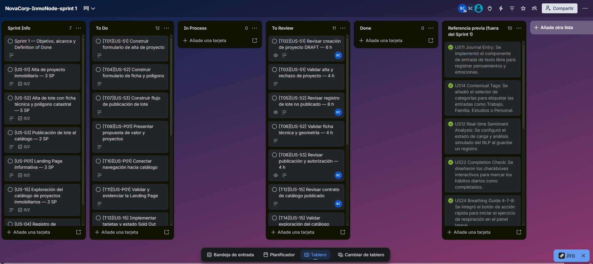
</p>

El tablero muestra el estado del Sprint al 2026-10-09. Las tarjetas de referencia previa se encuentran fuera de su alcance.

El tablero contiene 30 tarjetas: objetivo y Definition of Done, seis historias con criterios de aceptación y 23 tareas con descripción, estimación y responsable. Se observan 12 tareas en To Do y 11 en To Review, sin tareas en In Process o Done. Becker figura como miembro de T02, T05, T08, T12, T17 y T20. Las tarjetas ajenas al Sprint se agrupan en Referencia previa.

| Sprint # | Sprint 1 | | | | | | |
| :---: | :--- | :---: | :--- | :--- | :---: | :---: | :--- |
| **User Story** | | **Work-Item / Task** | | | | | |
| **Id** | **Title** | **Id** | **Title** | **Description** | **Estimation (Hours)** | **Assigned To (proposed)** | **Status** |
| US-51 | Alta de proyecto inmobiliario | T01 | Construir formulario de alta de proyecto | Capturar nombre, ubicación y etapas; mostrar campos requeridos y resultado de alta. | 6 | Breithner | To Do |
| US-51 | Alta de proyecto inmobiliario | T02 | Revisar creación de proyecto DRAFT | Revisar POST /api/v1/catalog/projects, validaciones, etapas y persistencia; código en RealEstateCatalogController. | 6 | Becker; Angel como colaborador | To Review |
| US-51 | Alta de proyecto inmobiliario | T03 | Validar alta y rechazo de proyecto | Revisar ProjectTest, etapas obligatorias/duplicadas y flujo PostgreSQL; adjuntar aceptación del formulario. | 4 | Mía; Becker como colaborador | To Review |
| US-52 | Alta de lote con ficha técnica y polígono catastral | T04 | Construir formulario de ficha y polígono | Capturar código, etapa, área, dimensiones, precio y polígono; presentar errores de geometría. | 6 | Breithner | To Do |
| US-52 | Alta de lote con ficha técnica y polígono catastral | T05 | Revisar registro de lote no publicado | Revisar POST /api/v1/catalog/projects/{projectId}/lots y consulta administrativa; guardar DRAFT y rechazar etapa ajena/código duplicado. | 8 | Becker; Angel como colaborador | To Review |
| US-52 | Alta de lote con ficha técnica y polígono catastral | T06 | Validar ficha técnica y geometría | Ejecutar pruebas de Polygon, coordenadas, lote DRAFT y rechazo HTTP de polígono inválido. | 4 | Mía; Becker como colaborador | To Review |
| US-53 | Publicación de lote al catálogo | T07 | Construir flujo de publicación de lote | Permitir confirmar publicación en back-office y mostrar errores por datos incompletos. | 6 | Breithner | To Do |
| US-53 | Publicación de lote al catálogo | T08 | Revisar publicación y autorización | Revisar PUT de publicación de proyecto/lote, transición AVAILABLE, rol CATALOG_ADMIN e idempotencia sin reiniciar lotes bloqueados. | 4 | Becker; Mía como colaboradora | To Review |
| US-P01 | Landing Page informativa | T09 | Presentar propuesta de valor y proyectos | Construir vista pública con propuesta de valor, proyectos destacados y llamadas a la acción. | 6 | Breithner | To Do |
| US-P01 | Landing Page informativa | T10 | Conectar navegación hacia catálogo | Verificar botones de proyecto y Cotizar; documentar dependencia de US-14 para acceso cuando corresponda. | 4 | Breithner | To Do |
| US-P01 | Landing Page informativa | T11 | Validar y evidenciar la Landing Page | Revisar vista sin sesión, navegación y adaptación a móvil; adjuntar capturas y resultado de aceptación. | 4 | Mía; Becker como colaborador | To Do |
| US-15 | Exploración del catálogo de proyectos inmobiliarios | T12 | Revisar contrato de catálogo publicado | Verificar listado/detalle, rango de precios, disponibilidad y exclusión de borradores. | 6 | Becker; Angel como colaborador | To Review |
| US-15 | Exploración del catálogo de proyectos inmobiliarios | T13 | Implementar tarjetas y estado Sold Out | Consumir catálogo con miniatura, precios y disponibilidad; mantener proyectos vendidos visibles con su etiqueta. | 6 | Breithner | To Do |
| US-15 | Exploración del catálogo de proyectos inmobiliarios | T14 | Validar exploración del catálogo | Revisar ProjectCatalogIntegrationTest y validar tarjetas con stock y sin stock en el cliente. | 4 | Mía; Becker como colaborador | To Review |
| US-04 | Registro de prospectos offline | T15 | Construir formulario y validación local | Capturar nombre, documento y teléfono; impedir guardado sin documento obligatorio. | 6 | Angel | To Do |
| US-04 | Registro de prospectos offline | T16 | Persistir prospecto y operación para sincronización | Guardar registro y cola local; comprobar permanencia después de cerrar y abrir la app sin red. | 8 | Angel | To Do |
| US-04 | Registro de prospectos offline | T17 | Revisar recepción de prospectos en backend | Revisar Prospect, ProspectCommandServiceImpl y persistencia idempotente; es soporte a sincronización futura. | 4 | Becker; Angel como colaborador | To Review |
| US-04 | Registro de prospectos offline | T18 | Probar registro de prospectos | Revisar ProspectTest e integración; documentar aceptación offline y rechazo sin documento en Android. | 4 | Mía; Becker como colaborador | To Review |
| Transversal | Testing | T19 | Completar aceptación automatizada BDD | Implementar .feature, Steps y runner para las seis historias; ejecutar y adjuntar resultados. | 8 | Mía; Becker y equipo como colaboradores | To Do |
| Transversal | Documentation | T20 | Revisar y capturar OpenAPI | Verificar esquemas, roles y respuestas del catálogo administrativo/público y prospectos; capturar Swagger. | 4 | Becker | To Review |
| Transversal | Deployment | T21 | Publicar y verificar Landing Page | Registrar proveedor, configuración y URL; comprobar acceso público y adjuntar evidencia. | 4 | Andy; Breithner como colaborador | To Do |
| Transversal | Deployment | T22 | Verificar entorno backend y automatización | Revisar Dockerfile, Compose y CI; ejecutar en entorno disponible y registrar health y resultados. | 6 | Andy; Becker como colaborador | To Review |
| Transversal | Deployment | T23 | Instalar y demostrar registro offline Android | Registrar APK/build, versión y dispositivo; demostrar US-04 sin conexión y adjuntar capturas/video. | 4 | Andy; Angel como colaborador | To Do |

La propuesta comprende 23 tareas y 122 horas estimadas, todas entre 4 y 8 horas. Las horas no se utilizan para afirmar velocidad ni finalización.

---
##### 4.2.1.4. Development Evidence for Sprint Review

Durante el Sprint se implementaron operaciones del catálogo en el backend y el registro local de prospectos en la aplicación Android. Las evidencias siguientes relacionan los archivos y commits de cada producto con las historias del Sprint y los avances de soporte.

**Backend**

El backend revisado corresponde a develop en 207b208 — `https://github.com/1ACC0238-2620-13981-NovaCorp-InmoNode/InmoNode-Backend/commit/207b20820d5f2e12e4bd1ab09e95a4378751c6fe`. Implementa alta de proyectos con etapas (US-51), registro individual de lotes DRAFT (US-52), publicación como AVAILABLE (US-53), consulta pública del catálogo (US-15) y recepción servidor de prospectos como soporte a US-04. RealEstateCatalogController, incorporado en 2b213d2, expone las operaciones administrativas; el catálogo aún reside en financial, sin acreditar la separación arquitectónica completa de bounded contexts.

| Repository | Branch | Commit Id | Commit Message | Commit Message Body | Commited on(Date) |
| --- | --- | --- | --- | --- | --- |
| InmoNode-Backend | feature/FINANCIAL → develop | d4099d1 — `https://github.com/1ACC0238-2620-13981-NovaCorp-InmoNode/InmoNode-Backend/commit/d4099d1c07b35f9a57f5c60d37b245c8ceabb468` | feat(financial): import project lots from a GeoJSON plan | Sin body registrado. | 2026-10-07 |
| InmoNode-Backend | feature/FINANCIAL → develop | b3ce1f6 — `https://github.com/1ACC0238-2620-13981-NovaCorp-InmoNode/InmoNode-Backend/commit/b3ce1f6da2e2567b40324ebc67507b928e96f8d5` | feat(financial): expose the published project catalog | Sin body registrado. | 2026-10-07 |
| InmoNode-Backend | feature/FIELD-SYNC → develop | 6d30f26 — `https://github.com/1ACC0238-2620-13981-NovaCorp-InmoNode/InmoNode-Backend/commit/6d30f2699e6f7a4e98c121f5ea7254553ebf5a55` | feat(catalog): register field prospects | Sin body registrado. | 2026-10-07 |
| InmoNode-Backend | feature/FIELD-SYNC → develop | 167d5f6 — `https://github.com/1ACC0238-2620-13981-NovaCorp-InmoNode/InmoNode-Backend/commit/167d5f6d2495640357f3bce18968d2ef3b17a065` | feat(financial): consolidate field reservations | Sin body registrado. | 2026-10-07 |
| InmoNode-Backend | feature/FIELD-SYNC → develop | 211bdb0 — `https://github.com/1ACC0238-2620-13981-NovaCorp-InmoNode/InmoNode-Backend/commit/211bdb05868ec0685e9ef9e3e6f676f6127f9f81` | feat(catalog): sync offline records from the field app | Sin body registrado. | 2026-10-07 |
| InmoNode-Backend | feature/health-check-and-api-docs → develop | 2b213d2 — `https://github.com/1ACC0238-2620-13981-NovaCorp-InmoNode/InmoNode-Backend/commit/2b213d2f77c90f2effdfc55846625cf0e1bd2ff4` | feat(initial):fixed | Sin body registrado. | 2026-10-09 |

Las ramas de procedencia se identifican por los merges de PR #3 — `https://github.com/1ACC0238-2620-13981-NovaCorp-InmoNode/InmoNode-Backend/pull/3`, PR #4 — `https://github.com/1ACC0238-2620-13981-NovaCorp-InmoNode/InmoNode-Backend/pull/4` y PR #9 — `https://github.com/1ACC0238-2620-13981-NovaCorp-InmoNode/InmoNode-Backend/pull/9` registrados en Git. Las fechas corresponden al autor del commit en zona -05:00. El texto de Commit Message se conserva literalmente; la descripción funcional de esta sección no se presenta como body del commit.

**Aplicación móvil Android**

La aplicación móvil revisada corresponde a `develop` en `8335b964730bc15c768b158a862ff8daf3b7ec8d` — `https://github.com/1ACC0238-2620-13981-NovaCorp-InmoNode/InmoNode-Mobile/tree/8335b964730bc15c768b158a862ff8daf3b7ec8d`. Se desarrolla en Kotlin con Jetpack Compose, Hilt y Room. El avance relacionado con US-04 comprende el formulario de registro de prospectos, la validación de datos y su almacenamiento local, junto con el seguimiento de registros por sincronizar. La configuración del cliente establece `https://inmonode-backend.onrender.com/api/v1/` como dirección base de los servicios.

El flujo utiliza `ProspectFormScreen`, `ProspectsViewModel` y `RegisterProspectUseCase`. El repositorio `ProspectRepositoryImpl` exige una sesión de agente, valida un documento de 8 a 12 caracteres alfanuméricos y un nombre de hasta 150 caracteres; el teléfono, cuando se proporciona, también se valida. El guardado genera un UUID y registra el prospecto mediante una transacción local, sin efectuar una llamada de red. `ProspectEntity` conserva el propietario, los datos de contacto, la fecha y el indicador `synced = false`; `ProspectDao` y `InmoNodeDatabase` proporcionan la persistencia con Room. El ViewModel observa los registros locales, informa la conectividad y mantiene los campos del formulario mediante SavedStateHandle.

Como soporte adicional, `FieldSyncRepositoryImpl` selecciona los prospectos sin sincronizar, envía lotes al backend y actualiza el estado local después de validar la respuesta. Si la solicitud falla o se interrumpe, los registros conservan su estado para permitir un nuevo intento. `PortfolioRepositoryImpl` implementa descarga y almacenamiento local de proyectos y lotes, con manejo de ETag y respuesta 304. Estas capacidades, junto con los cambios de sesión y red, se presentan como avances complementarios; la descarga del portafolio y las reservas no modifican las historias seleccionadas para el Sprint 1.

| Repository | Branch | Commit Id | Commit Message | Commit Message Body | Commited on(Date) |
| --- | --- | --- | --- | --- | --- |
| InmoNode-Mobile | feature/US-01-login → develop | 79af30f — `https://github.com/1ACC0238-2620-13981-NovaCorp-InmoNode/InmoNode-Mobile/commit/79af30f5559f480473fde8f526674f42f511e065` | feat(fieldsales): update ProspectFormScreen.kt | Sin body registrado. | 2026-10-09 |
| InmoNode-Mobile | feature/US-01-login → develop | c0bce40 — `https://github.com/1ACC0238-2620-13981-NovaCorp-InmoNode/InmoNode-Mobile/commit/c0bce4034a47f5a8ed0b509c7ce1205d364f12c5` | feat(fieldsales): update ProspectsViewModel.kt | Sin body registrado. | 2026-10-09 |
| InmoNode-Mobile | feature/US-01-login → develop | 848150d — `https://github.com/1ACC0238-2620-13981-NovaCorp-InmoNode/InmoNode-Mobile/commit/848150d800cfff7b5f374d2ec68fa25bac6fa825` | feat(fieldsales): update ProspectRepositoryImpl.kt | Sin body registrado. | 2026-10-09 |
| InmoNode-Mobile | feature/US-01-login → develop | ddd40a7 — `https://github.com/1ACC0238-2620-13981-NovaCorp-InmoNode/InmoNode-Mobile/commit/ddd40a7f11e21c92c714f290712b9a71e7c0b5ee` | feat(fieldsales): update ProspectEntity.kt | Sin body registrado. | 2026-10-09 |
| InmoNode-Mobile | feature/US-01-login → develop | 7c8b606 — `https://github.com/1ACC0238-2620-13981-NovaCorp-InmoNode/InmoNode-Mobile/commit/7c8b606e5bfe27332b68beb6bd5dbc076711da2a` | feat(fieldsales): update ProspectDao.kt | Sin body registrado. | 2026-10-09 |
| InmoNode-Mobile | feature/US-01-login → develop | 0dd7707 — `https://github.com/1ACC0238-2620-13981-NovaCorp-InmoNode/InmoNode-Mobile/commit/0dd7707932e5b62758f9c05ddb1f2e0634818f06` | feat(database): update InmoNodeDatabase.kt | Sin body registrado. | 2026-10-09 |
| InmoNode-Mobile | feature/US-01-login → develop | c1b6e5c — `https://github.com/1ACC0238-2620-13981-NovaCorp-InmoNode/InmoNode-Mobile/commit/c1b6e5c8f3a4485eaffc66a1b1dce097fd7d3cf6` | feat(fieldsales): update FieldSyncRepositoryImpl.kt | Sin body registrado. | 2026-10-09 |
| InmoNode-Mobile | feature/US-01-login → develop | c752de2 — `https://github.com/1ACC0238-2620-13981-NovaCorp-InmoNode/InmoNode-Mobile/commit/c752de24b3ffc0a09d18404a7f96cd45c4ffb753` | feat(fieldsales): update PortfolioRepositoryImpl.kt | Sin body registrado. | 2026-10-09 |
| InmoNode-Mobile | feature/US-01-login → develop | 03d510e — `https://github.com/1ACC0238-2620-13981-NovaCorp-InmoNode/InmoNode-Mobile/commit/03d510e545e5eee930979d66420f6f9a9074eaef` | fix(iam): update AuthRepositoryImpl.kt | Sin body registrado. | 2026-10-09 |
| InmoNode-Mobile | feature/US-01-login → develop | 7a6a32f — `https://github.com/1ACC0238-2620-13981-NovaCorp-InmoNode/InmoNode-Mobile/commit/7a6a32f2d66cff8ec4bb8e07a9b6732d65c4c693` | feat(di): update NetworkModule.kt | Sin body registrado. | 2026-10-09 |
| InmoNode-Mobile | feature/US-01-login → develop | 8335b96 — `https://github.com/1ACC0238-2620-13981-NovaCorp-InmoNode/InmoNode-Mobile/commit/8335b964730bc15c768b158a862ff8daf3b7ec8d` | Merge pull request #4 from 1ACC0238-2620-13981-NovaCorp-InmoNode/feature/US-01-login | Feature/us 01 login | 2026-10-09 |

Los commits de la tabla forman parte del historial integrado mediante PR #4 — `https://github.com/1ACC0238-2620-13981-NovaCorp-InmoNode/InmoNode-Mobile/pull/4`. Aunque la rama de origen se denomina `feature/US-01-login`, contiene también cambios de `fieldsales`, persistencia y red, identificados por los archivos modificados. Las fechas se expresan en UTC−05:00 y los mensajes y bodies reproducen los valores registrados en Git. Esta evidencia documenta la implementación existente en el repositorio; la conservación de prospectos tras reiniciar el dispositivo sin conexión y la interacción con el backend requieren evidencia de ejecución para acreditar los criterios de aceptación de US-04.

---
##### 4.2.1.5. Testing Suite Evidence for Sprint Review

Se ejecutó una selección de 53 pruebas de dominio y controladores y, por separado, tres pruebas de integración contra PostgreSQL 18.6 en la base aislada inmonode_jpa_validation. La comprobación original reúne **56 pruebas, cero fallos, cero errores y cero omisiones**. Para el alcance alineado se ejecutaron además siete pruebas de alta/publicación y autorización: **63 casos comprobados en total**, sin fallos, errores u omisiones. Maven compiló fuentes y pruebas con release 21 usando JetBrains Runtime 25.0.3. La selección incluye reglas de soporte y casos técnicos adicionales; no son 63 pruebas de aceptación de las seis historias. Las tres pruebas locales simulan explícitamente ObjectStorage y no validan S3. La suite completa con Testcontainers no se ejecutó: Docker Engine no estaba disponible.

Las rutas de la tabla son relativas a src/test/java/com/novacorp/inmonode/inmonodebackend en la revisión auditada — `https://github.com/1ACC0238-2620-13981-NovaCorp-InmoNode/InmoNode-Backend/tree/207b20820d5f2e12e4bd1ab09e95a4378751c6fe/src/test/java/com/novacorp/inmonode/inmonodebackend`.

| Test Id | Type | User Story / relación | Class and behavior | Test File | Execution Result / Evidence |
| --- | --- | --- | --- | --- | --- |
| TS01 | Unit | US-04, reglas de soporte | Prospect: normalización, documento obligatorio, teléfono y actualización de contacto. | catalog/domain/model/aggregates/ProspectTest.java | 4 casos pasan; no comprueban base local Android. |
| TS02 | Unit | US-52, validación de geometría | LotBoundary y GeoPoint: validez del polígono y coordenadas. | financial/domain/model/valueobjects/LotBoundaryTest.java; GeoPointTest.java | 5 + 2 casos pasan. |
| TS03 | Unit | US-52 / US-53, reglas del lote | Lot: dimensiones, estado y bloqueo. | financial/domain/model/aggregates/LotTest.java | 12 casos pasan; no comprueban el estado local del dispositivo. |
| TS04 | Unit | US-15, catálogo | Project y LotStatistics: publicación y cálculo de disponibilidad. | financial/domain/model/aggregates/ProjectTest.java; financial/domain/model/valueobjects/LotStatisticsTest.java | 4 + 2 casos pasan. |
| TS05 | Unit | Fuera del alcance actual; soporte de reservas futuras | Reservation: identificadores de campo, estados y vigencia; incluye casos de otros flujos. | financial/domain/model/aggregates/ReservationTest.java | 17 casos pasan. |
| TS06 | Unit / MVC slice | Soporte técnico de consulta; filtros de US-16 fuera del Sprint | Validación de rangos y viewport, con colaboradores simulados. | financial/interfaces/rest/ProjectLotsFiltersTest.java | 3 casos pasan; no es integración con PostgreSQL. |
| TS07 | Unit / MVC slice | Transversal, disponibilidad | HealthController: 200 con base disponible y 503 ante fallo de la base simulada. | shared/interfaces/rest/HealthControllerTest.java | 4 casos pasan. |
| TS08 | Integration | US-51/52/53; soporte US-04; otros flujos adicionales | Flujo persistente WEB, rechazo/sustitución de evidencia y validación/rollback de sincronización de campo. | financial/interfaces/rest/LocalPostgresFlowIntegrationTest.java | 3 casos pasan con PostgreSQL real y ObjectStorage simulado. |
| TS09 | Integration, Testcontainers | US-15; consulta geométrica de soporte | Catálogo publicado, borradores ocultos, Sold Out y GeoJSON por código. | financial/interfaces/rest/ProjectCatalogIntegrationTest.java | Código existente; no ejecutado en esta revisión por Docker no disponible. |
| TS10 | Integration, Testcontainers | US-04, recepción servidor | Alta/actualización de prospectos por UUID. | catalog/application/internal/commandservices/ProspectRegistrationIntegrationTest.java | Sin ejecución registrada en esta revisión. |
| TS11 | Integration, Testcontainers | Fuera del Sprint 1; soporte de US-11 / US-12 | Consolidación, conflictos, duplicados y autorización del lote sincronizado. | financial/application/acl/ReservationConsolidationIntegrationTest.java; catalog/interfaces/rest/FieldRecordsControllerIntegrationTest.java | Sin ejecución registrada en esta revisión. |
| TS12 | Unit | US-51 / US-52 / US-53 | Etapas normalizadas/únicas; alta de lote DRAFT; bloqueo de etapa ajena/código duplicado; publicación requiere proyecto publicado y no reinicia BLOCKED. | financial/application/internal/commandservices/IndividualLotPublicationTest.java | 4 casos pasan, con repositorios simulados. |
| TS13 | Unit / MVC slice | US-51 / US-52 / US-53 | Rechazo 400 por etapas ausentes/duplicadas y polígono cruzado; BUYER recibe 403 en inventario/publicación administrativos. | financial/interfaces/rest/IndividualCatalogAuthorizationTest.java | 3 casos pasan; servicios simulados. |

Comandos reproducibles desde el backend, con un JDK funcional de versión 21 o posterior:

```powershell
.\mvnw.cmd --batch-mode --no-transfer-progress '-Dtest=ProspectTest,LotTest,LotBoundaryTest,GeoPointTest,ProjectTest,LotStatisticsTest,ReservationTest,HealthControllerTest,ProjectLotsFiltersTest' test

# Solo contra la base aislada de pruebas previamente disponible.
$env:INMONODE_VALIDATION_DB_URL='jdbc:postgresql://127.0.0.1:55432/inmonode_jpa_validation'
$env:INMONODE_VALIDATION_DB_USER='inmonode_test'
.\mvnw.cmd --batch-mode --no-transfer-progress '-Dtest=LocalPostgresFlowIntegrationTest' test

.\mvnw.cmd --batch-mode --no-transfer-progress '-Dtest=IndividualLotPublicationTest,IndividualCatalogAuthorizationTest' test

# Suite completa: requiere Docker operativo.
.\mvnw.cmd --batch-mode --no-transfer-progress verify
```

**Especificaciones de aceptación:** los escenarios Gherkin siguientes describen los comportamientos de las historias del Sprint. Son especificaciones funcionales; los resultados de ejecución registrados en esta sección corresponden a JUnit, pruebas MVC e integración PostgreSQL.

```gherkin
@US-P01
Feature: Informative landing page
  Scenario: Show the public value proposition
    Given a visitor has not signed in
    When the visitor opens the landing page
    Then the value proposition and featured projects are visible
    And the visitor can navigate to the catalog or registration flow

  Scenario: Navigate from a featured project
    Given a visitor is viewing a featured project on the landing page
    When the visitor selects the project or the "Cotizar" action
    Then the catalog exploration flow is opened
    And registration is requested if the visitor has not signed in

@US-15
Feature: Explore real estate projects
  Scenario: Show active project information
    Given the buyer has signed in
    When the buyer opens the project catalog
    Then active projects display a representative thumbnail
    And each project shows its price range and availability percentage

  Scenario: Keep a sold out project visible
    Given the buyer has signed in
    And all lots of a published project are sold
    When the buyer opens the project catalog
    Then the project remains visible
    And its availability is zero and its card shows "Sold Out"

@US-04
Feature: Register prospects offline
  Scenario: Keep a prospect after restarting without connectivity
    Given the field app is offline
    When the agent saves a prospect with name, document and phone
    And restarts the app while still offline
    Then the prospect remains in the local database
    And its synchronization operation is pending

  Scenario: Reject a prospect without its document
    Given the field app is offline
    When the agent tries to save a prospect without a document
    Then no prospect is saved and a required document message is shown

@US-51
Feature: Register a real estate project
  Scenario: Create a draft project
    Given the catalog administrator provides a valid name, location and stages
    When the administrator registers the project
    Then the project is created as DRAFT and allows lot registration

  Scenario: Reject incomplete project data
    Given a catalog administrator omits the required location
    When the administrator tries to register the project
    Then no project is created and the missing field is reported

@US-52
Feature: Register an unpublished lot
  Scenario: Create a complete lot in an existing project
    Given an existing project and a valid stage
    When the administrator submits code, dimensions, area, price and polygon
    Then the lot is stored as DRAFT and linked to the project
    And the lot is not offered for separation

  Scenario: Reject an invalid polygon
    Given the lot coordinates do not form a valid closed polygon
    When the administrator tries to register the lot
    Then no lot is stored and a polygon validation message is shown

@US-53
Feature: Publish a complete lot
  Scenario: Expose a complete lot as available
    Given a draft lot has a valid project, price and polygon
    And its project is published
    When the administrator publishes the lot
    Then the lot becomes AVAILABLE and appears in the public catalog

  Scenario: Reject incomplete publication
    Given a lot is missing the required polygon or price
    When the administrator tries to publish the lot
    Then publication is blocked and the missing data is reported
```

| Repository | Branch | Commit Id | Commit Message | Commit Message Body | Commited on(Date) |
| --- | --- | --- | --- | --- | --- |
| InmoNode-Backend | feature/FINANCIAL → develop | b3ce1f6 | feat(financial): expose the published project catalog | Sin body; incluye ProjectCatalogIntegrationTest y LotStatisticsTest. | 2026-10-07 |
| InmoNode-Backend | feature/FINANCIAL → develop | d4099d1 | feat(financial): import project lots from a GeoJSON plan | Sin body; incluye LotTest y LotBoundaryTest. | 2026-10-07 |
| InmoNode-Backend | feature/FIELD-SYNC → develop | 6d30f26 | feat(catalog): register field prospects | Sin body; incluye ProspectTest y ProspectRegistrationIntegrationTest. | 2026-10-07 |
| InmoNode-Backend | feature/FIELD-SYNC → develop | 167d5f6 | feat(financial): consolidate field reservations | Sin body; incluye ReservationConsolidationIntegrationTest. | 2026-10-07 |
| InmoNode-Backend | feature/health-check-and-api-docs → develop | 2b213d2 | feat(initial):fixed | Sin body; agrega pruebas de catálogo individual/autorización, health, filtros y flujo PostgreSQL local. | 2026-10-09 |

Los enlaces de commits y del repositorio están en 4.2.1.4. Las descripciones de archivos en esta tabla son anotaciones de evidencia, no contenido literal del body. Los resultados generados localmente no están versionados en el backend; su resumen se incorpora como evidencia del informe.

---
##### 4.2.1.6. Execution Evidence for Sprint Review

El 2026-10-09 se comprobaron respuestas HTTP 200 en localhost:8081 para GET /health, catálogo de proyectos, detalle del proyecto 1, sus lotes y OpenAPI. La revisión de código utilizada fue 207b208; el proceso local no expone su commit de compilación.

| Producto | Historia | Flujo | Resultado | Evidencia |
| --- | --- | --- | --- | --- |
| Web Services | US-15 | Listado y detalle de proyectos | La consulta local devuelve el proyecto de prueba, rango PEN 45000–45000, un lote y 0 % disponible. El detalle del proyecto 1 devuelve PUBLISHED y etapas Norte/Sur. El lote BLOCKED mantiene soldOut=false. | Contrato del catálogo en 4.2.1.7. |
| Web Services | US-52 / US-15 | Consulta de lotes GeoJSON | La consulta local devuelve FeatureCollection con lote N-01, Polygon cerrado, área 120 y estado BLOCKED. | Contrato de consulta y filtros en 4.2.1.7. |
| Web Services | US-51 / US-52 / US-53 | Alta y publicación | LocalPostgresFlowIntegrationTest comprueba creación DRAFT, etapas, lotes y publicación con PostgreSQL; las pruebas adicionales cubren validaciones y autorización. | Resultados de pruebas en 4.2.1.5 y contratos en 4.2.1.7. |
| Web Services | Transversal | Disponibilidad pública | GET /health en Render devuelve HTTP 200, status UP, API UP y database UP. | Captura render-health.jpeg en 4.2.1.8. |

**Vistas de la aplicación Android**

Las capturas se organizan según el flujo de acceso, registro de prospectos y consulta de su estado. El formulario, la validación, el guardado sin conexión y la consulta después de reiniciar corresponden a US-04. Las vistas de portafolio, mapa, sincronización y perfil presentan capacidades de soporte de la aplicación.

**1. Inicio de sesión**

Acceso del agente a la aplicación.

<p align="center">
  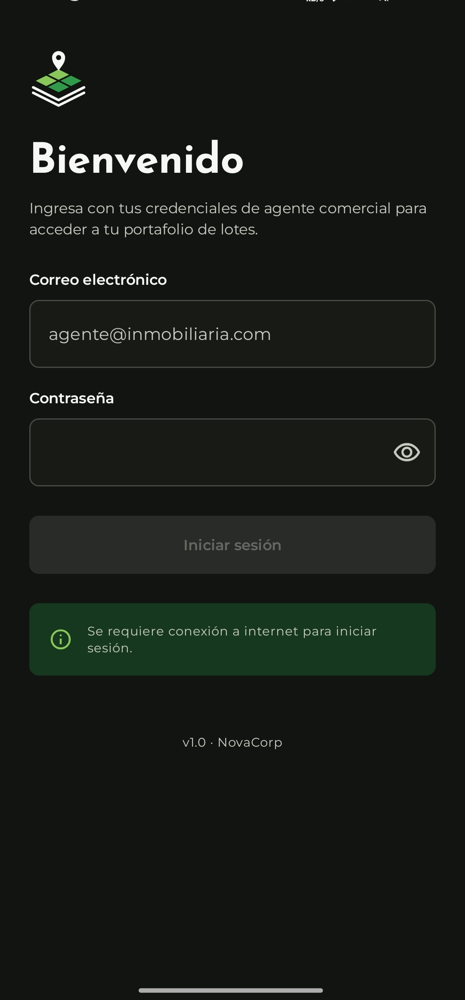
</p>

**2. Descarga del portafolio**

Vista de descarga y disponibilidad local del portafolio.

<p align="center">
  
</p>

**3. Mapa catastral**

Vista del mapa con los lotes del portafolio.

<p align="center">
  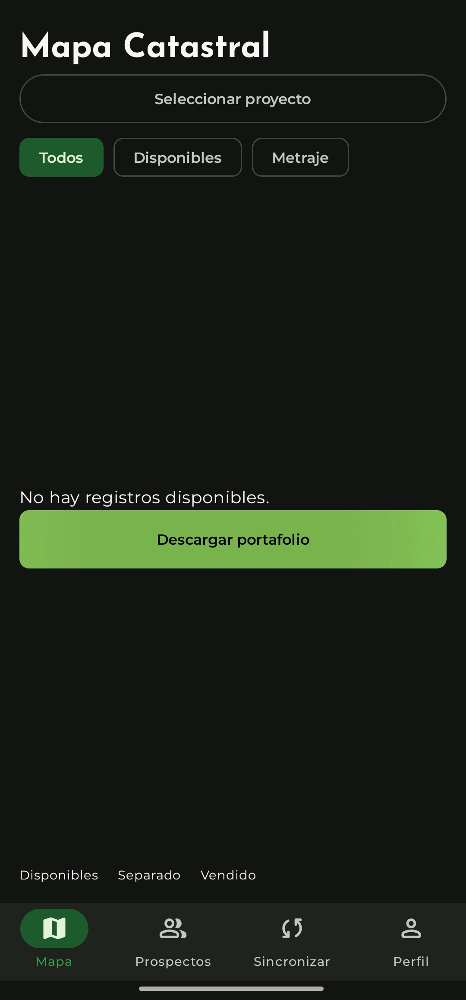
</p>

**4. Lista de prospectos — US-04**

Vista de los prospectos registrados por el agente.

<p align="center">
  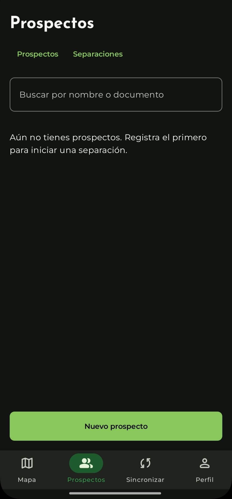
</p>

**5. Formulario de registro — US-04**

Formulario con los datos del prospecto y el estado de conectividad.

<p align="center">
  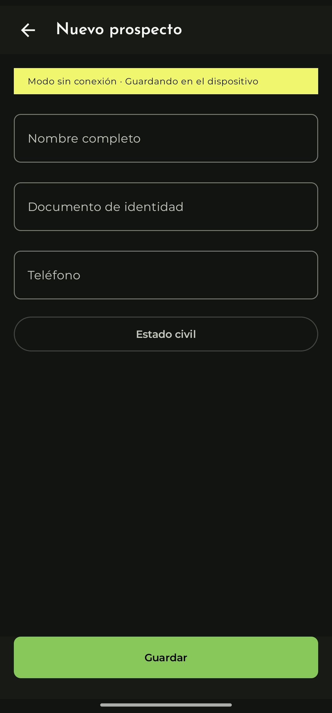
</p>

**6. Validación del documento — US-04**

Mensaje de validación al intentar guardar un prospecto sin documento.

<p align="center">
  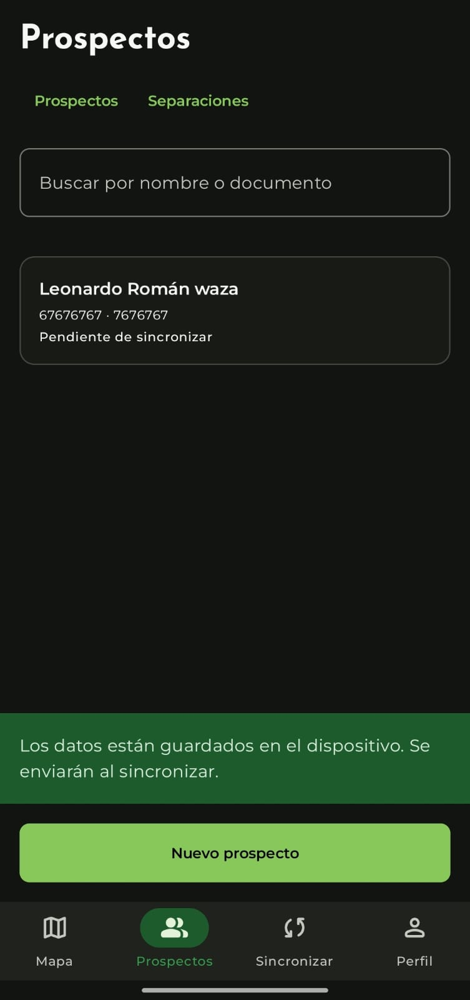
</p>

**7. Prospecto guardado sin conexión — US-04**

Lista de prospectos después de guardar el registro sin conexión.

<p align="center">
  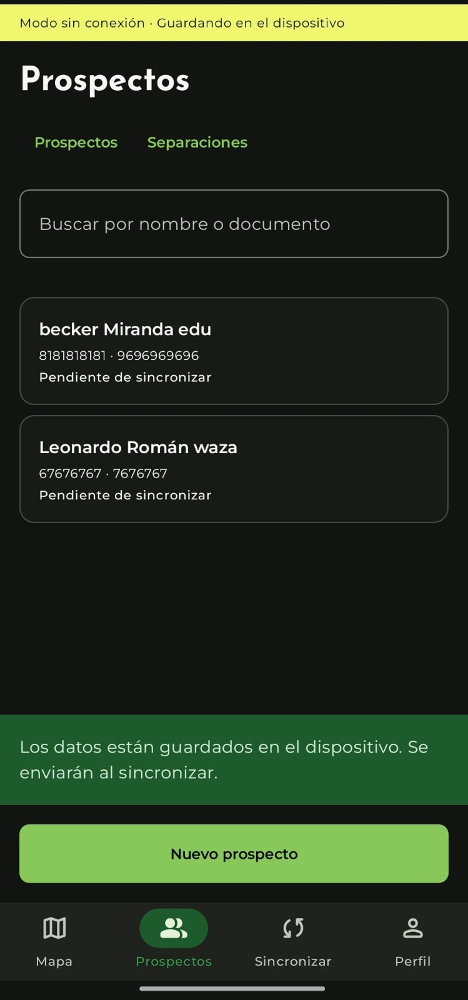
</p>


**8. Estado de sincronización**

Vista del estado de los registros y operaciones de sincronización.

<p align="center">
  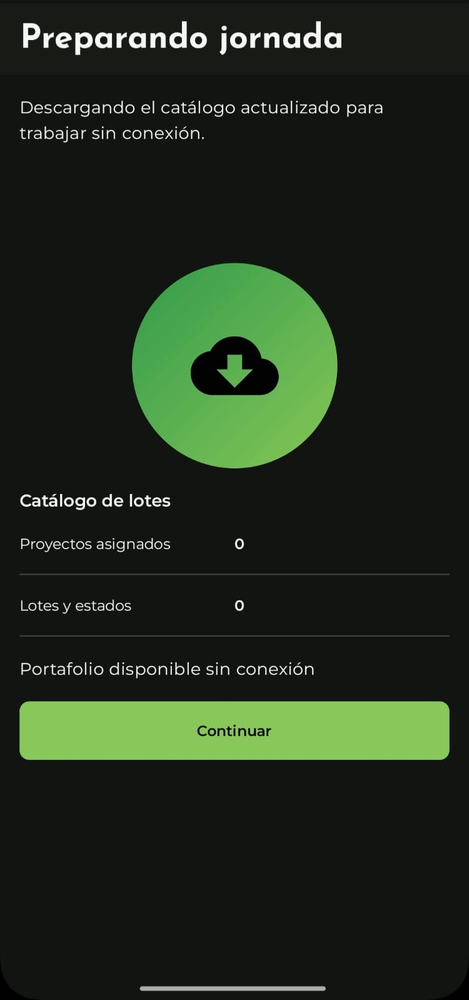
</p>

**9. Perfil del agente**

Vista de la información de la sesión y la opción de cierre de sesión.

<p align="center">
  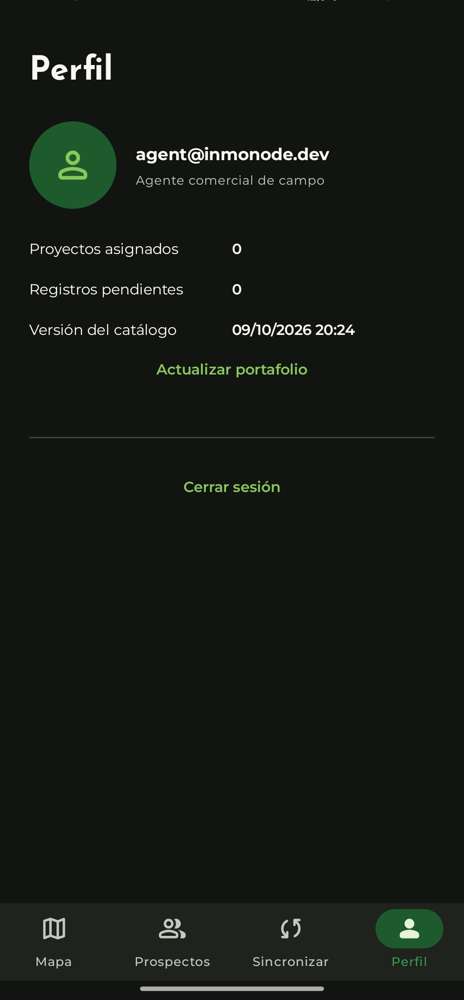
</p>

---
##### 4.2.1.7. Services Documentation Evidence for Sprint Review

**Entorno público desplegado:** `https://inmonode-backend.onrender.com/swagger-ui/index.html`. Las capturas revisadas en 4.2.1.8 identifican Render, servicio InmoNode-Backend Docker, rama main, commit cac4444 y despliegue exitoso del 2026-10-09. Una consulta real GET /health devuelve HTTP 200 con API y base de datos UP. La auditoría local previa corresponde a 207b208; sus resultados no se trasladan automáticamente a la revisión desplegada.

El backend contiene springdoc-openapi-starter-webmvc-ui 3.0.3, configuración OpenAPI, etiquetas y descripciones de operaciones. Se verificó la especificación OpenAPI 3.1.0 en localhost:8081/v3/api-docs — `http://localhost:8081/v3/api-docs` y Swagger UI en localhost:8081/api-docs — `http://localhost:8081/api-docs`. Son URLs locales del entorno de validación; no una documentación pública desplegada. En dev Swagger está habilitado; en prod Swagger UI y API docs están deshabilitados.

La tabla incluye alta de proyecto/lote y publicación (US-51/52/53), catálogo público (US-15) y servicios de soporte para futura sincronización de prospectos y disponibilidad. Los ejemplos de catálogo/plano corresponden a la captura real; los ejemplos autenticados se marcan como ilustrativos.

| Endpoint | Implemented Action | HTTP Verb | Call Syntax | Parameters | Response Example | Response Explanation | Documentation URL |
| --- | --- | --- | --- | --- | --- | --- | --- |
| /api/v1/catalog/projects | Crear proyecto Borrador; US-51 | POST | POST `http://localhost:8081/api/v1/catalog/projects` | JWT CATALOG_ADMIN; name, location, stages y financingRules obligatorios; coordenadas/cover opcionales. Ejemplo E. | Ilustrativo: 201; id, status=DRAFT, stages y reglas. | No publica el proyecto; campos incompletos o etapas inválidas producen 400. | Swagger local, Real estate catalog — `http://localhost:8081/api-docs` |
| /api/v1/catalog/projects/{projectId}/lots | Registrar lote No publicado; US-52 | POST | POST `http://localhost:8081/api/v1/catalog/projects/1/lots` | JWT CATALOG_ADMIN; projectId, code, stageName, area, price, polygon; front/depth opcionales. Ejemplo F. | Ilustrativo: 201; id, projectId, status=DRAFT y geometry. | Etapa debe pertenecer al proyecto; precio/área positivos; polígono válido; código duplicado 409. | Swagger local, Real estate catalog — `http://localhost:8081/api-docs` |
| /api/v1/catalog/projects/{projectId}/lots | Consultar inventario administrativo; soporte US-52 | GET | GET `http://localhost:8081/api/v1/catalog/projects/1/lots` | JWT CATALOG_ADMIN; projectId en ruta. | Ilustrativo: 200; arreglo de CatalogLotResource, incluido DRAFT. | Permite verificar lotes antes de publicar; no es el listado público. | Swagger local — `http://localhost:8081/api-docs` |
| /api/v1/catalog/projects/{projectId}/publish | Publicar proyecto; prerrequisito US-53 | PUT | PUT `http://localhost:8081/api/v1/catalog/projects/1/publish` | JWT CATALOG_ADMIN; projectId; sin body. | Ilustrativo: 200; status=PUBLISHED. | Requiere lotes; sin lotes produce 422. Publicar proyecto no reemplaza publicación individual del lote. | Swagger local — `http://localhost:8081/api-docs` |
| /api/v1/catalog/lots/{lotId}/publish | Publicar lote; US-53 | PUT | PUT `http://localhost:8081/api/v1/catalog/lots/1/publish` | JWT CATALOG_ADMIN; lotId; sin body. | Ilustrativo: 200; status=AVAILABLE para lote DRAFT válido. | Requiere proyecto publicado; proyecto no publicado produce 422. Repetir no reinicia BLOCKED/RESERVED/SOLD. | Swagger local — `http://localhost:8081/api-docs` |
| /api/v1/projects | Listar proyectos publicados; US-15 | GET | GET `http://localhost:8081/api/v1/projects` | Sin parámetros obligatorios; acceso público. | 200; ejemplo completo A, abajo. | Lista con id, nombre, ubicación, miniatura, priceRange, totalLots, availabilityPercentage y soldOut. Puede devolver []. | Swagger local, Projects — `http://localhost:8081/api-docs` |
| /api/v1/projects/{projectId} | Consultar detalle; US-15 | GET | GET `http://localhost:8081/api/v1/projects/1` | projectId: Long en ruta. Público para publicados; borrador solo CATALOG_ADMIN. | 200; id=1, status=PUBLISHED, stages=[Norte, Sur], financingRules con TEA=12.0000. | Incluye reglas financieras y etapas; inexistente o borrador no autorizado produce 404. | Swagger local, Projects — `http://localhost:8081/api-docs` |
| /api/v1/projects/{projectId}/lots | Consultar plano; consulta del lote US-52 / US-15 | GET | GET `http://localhost:8081/api/v1/projects/1/lots` | projectId; opcionales minArea, maxArea, minPrice, maxPrice, status; viewport west/south/east/north juntos. | 200; ejemplo completo B, abajo. | GeoJSON con coordenadas [longitud, latitud], propiedades comerciales y estado. Sin coincidencias: features=[]; rangos/viewport inválidos: 400; proyecto no visible: 404. | Swagger local, Projects — `http://localhost:8081/api-docs` |
| /api/v1/field-sync/portfolio | Descargar datos iniciales para cliente offline; dependencia US-02 | GET | GET `http://localhost:8081/api/v1/field-sync/portfolio` | JWT de FIELD_AGENT; If-None-Match opcional. | Ilustrativo: 200, {"projects":[]}; ETag en header. | Cada proyecto incluye reglas y lotes GeoJSON; 304 sin cuerpo cuando el ETag coincide. No constituye descarga incremental con syncToken. | Swagger local, Field sync — `http://localhost:8081/api-docs` |
| /api/v1/field-sync | Recibir prospectos/reservas; soporte US-04, sincronización futura US-11 / US-12 / US-32 | POST | POST `http://localhost:8081/api/v1/field-sync` | JWT FIELD_AGENT y body JSON; ejemplos C/D. Hasta 500 prospectos y 200 reservas. | Ilustrativo: 201, {"prospectsSynced":1,"reservations":[]}. | Resultado por reserva: SYNCED, CONFLICT o DUPLICATE; el cliente revisa cada resultado. Payload inválido: 400 sin guardar. No equivale a registro offline en dispositivo. | Swagger local, Field sync — `http://localhost:8081/api-docs` |
| /health | Comprobar disponibilidad; transversal | GET | GET `http://localhost:8081/health` | Sin autenticación. | 200, {"status":"UP","services":{"database":"UP","api":"UP"},"message":"All services are available"}. | 503 si falla PostgreSQL; el 200 observado solo acredita el momento de la consulta. | Swagger local, especificación — `http://localhost:8081/v3/api-docs` |

**A. Response real de catálogo**, datos locales de prueba:

```json
[{"id":1,"name":"Validación de etapas","location":"Lima - datos de prueba",
  "latitude":null,"longitude":null,"coverImageUrl":null,
  "priceRange":{"min":45000.00,"max":45000.00,"currency":"PEN"},
  "totalLots":1,"availabilityPercentage":0.00,"soldOut":false}]
```

**B. Response real del plano**, datos locales de prueba:

```json
{"type":"FeatureCollection","features":[{"type":"Feature","id":1,
  "geometry":{"type":"Polygon","coordinates":[[[-76.7,-12.5],[-76.69,-12.5],
    [-76.69,-12.49],[-76.7,-12.49],[-76.7,-12.5]]]},
  "properties":{"code":"N-01","area":120.00,"front":10.00,"depth":12.00,
    "price":45000.00,"currency":"PEN","status":"BLOCKED"}}]}
```

**C. Request ilustrativo para recepción de un prospecto**, no ejecutado por HTTP en esta revisión. RegisteredAt puede omitirse; documento acepta 8–12 caracteres alfanuméricos, nombre hasta 150 y teléfono hasta 20, sujeto a validación del dominio:

```json
{"prospects":[{"id":"11111111-1111-4111-8111-111111111111",
  "document":"12345678","fullName":"Ana Quispe",
  "phone":"+51 987654321","registeredAt":"2026-10-09T08:00:00Z"}],
 "reservations":[]}
```

**D. Registro de reserva dentro del body de sincronización**, ilustrativo. Se añade al arreglo reservations de C usando el id real de un lote disponible; no ejecutar sobre N-01 mientras esté BLOCKED:

```json
{"id":"22222222-2222-4222-8222-222222222222","lotId":2,
 "prospectId":"11111111-1111-4111-8111-111111111111",
 "initialAmount":1500.00,"reservedAt":"2026-10-09T08:05:00Z"}
```

Id y prospectId son UUID generados en el dispositivo; lotId es obligatorio, initialAmount debe ser positivo y reservedAt obligatorio. El reintento conserva el mismo UUID. Un resultado SYNCED incluye reservationStatus y blockedUntil; CONFLICT aporta conflictReason, y DUPLICATE informa originalResult. Los ejemplos C/D no constituyen prueba de integración móvil.

**E. Request ilustrativo de proyecto (US-51):**

```json
{
  "name": "Proyecto de prueba",
  "location": "Lima - datos de prueba",
  "stages": [
    "Norte",
    "Sur"
  ],
  "financingRules": {
    "minDownPaymentPercentage": 20,
    "annualInterestRate": 12,
    "maxTermMonths": 120,
    "lateFeeRate": 1.5
  }
}
```

**F. Request ilustrativo de lote (US-52)**; usar projectId y etapa reales del entorno de prueba:

```json
{
  "code": "A-01",
  "stageName": "Norte",
  "area": 120,
  "front": 10,
  "depth": 12,
  "price": 45000,
  "polygon": [
    [
      [
        -76.7,
        -12.5
      ],
      [
        -76.69,
        -12.5
      ],
      [
        -76.69,
        -12.49
      ],
      [
        -76.7,
        -12.49
      ],
      [
        -76.7,
        -12.5
      ]
    ]
  ]
}
```

DRAFT equivale a Borrador de proyecto o No publicado de lote; AVAILABLE expresa lote publicado y disponible. El endpoint admite dimensiones front/depth opcionales. El catálogo administrativo se documenta dentro de financial conforme al código actual.

**Capturas incorporadas de Swagger**

Las capturas presentan los contratos OpenAPI de alta y publicación de catálogo, consultas públicas y sincronización de campo. La respuesta ejecutada de portfolio muestra HTTP 401 por autenticación. Los ejemplos de Swagger describen esquemas y códigos documentados; las respuestas de ejecución se identifican como Server response.

**Vista general de la documentación — Documentación**

Muestra InmoNode-Backend, versión declarada 0.0.1-SNAPSHOT, OAS 3.1 y grupos Account statements, Field sync y Vouchers. El recorte no incluye la barra de direcciones ni todos los grupos.

<p align="center">
  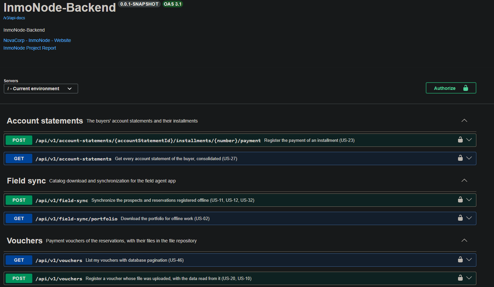
</p>

**Contrato de alta de proyecto — US-51**

Muestra POST /api/v1/catalog/projects, ejemplo de request y respuesta 201 documentada. No contiene Server response ni un proyecto creado.

<p align="center">
  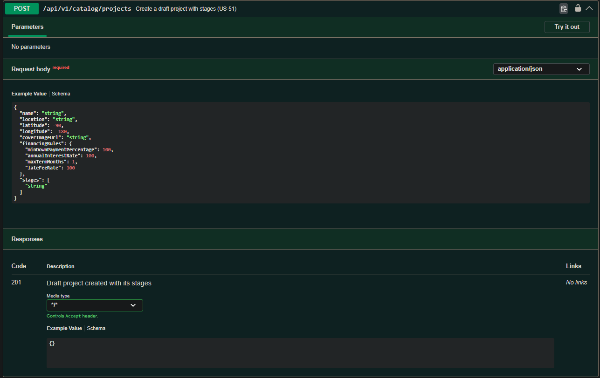
</p>

**Contrato de alta de lote — US-52**

Muestra POST /api/v1/catalog/projects/{projectId}/lots, parámetros, campos de ficha y polígono, y respuesta 201 documentada. No acredita persistencia ni un lote DRAFT creado.

<p align="center">
  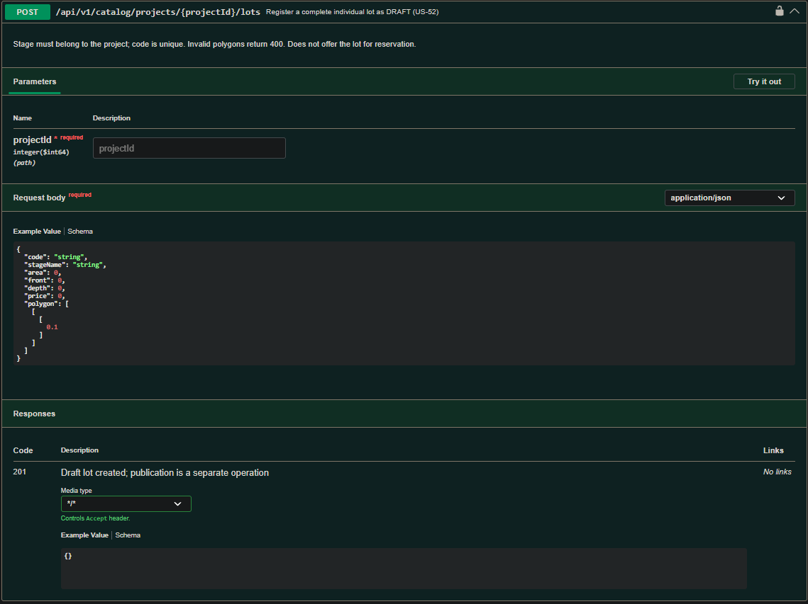
</p>

**Contrato de publicación de proyecto — Prerrequisito US-53**

Muestra PUT /api/v1/catalog/projects/{projectId}/publish y respuesta 200 documentada. El projectId no está completado; no acredita transición PUBLISHED.

<p align="center">
  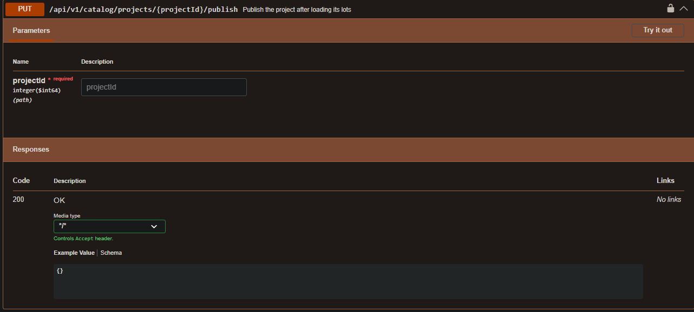
</p>

**Contrato de publicación de lote — US-53**

Muestra PUT /api/v1/catalog/lots/{lotId}/publish y la descripción de la transición AVAILABLE. No contiene un lotId enviado ni respuesta ejecutada.

<p align="center">
  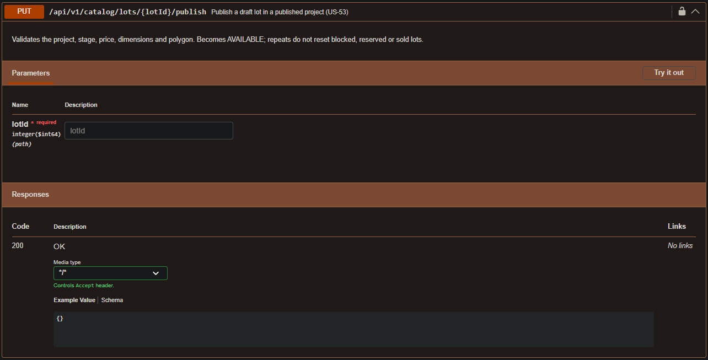
</p>

**Contrato del catálogo público — US-15**

Muestra GET /api/v1/projects y Example Value con priceRange, totalLots, availabilityPercentage y soldOut. Los valores de ejemplo no son datos obtenidos del catálogo.

<p align="center">
  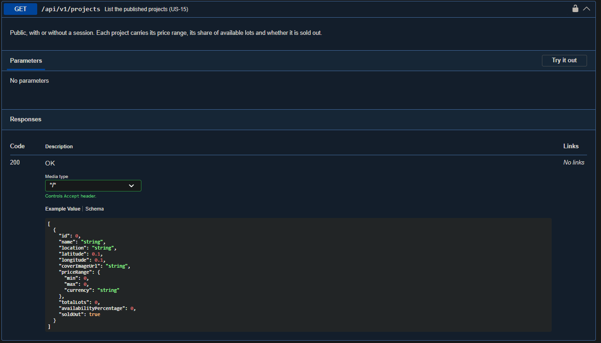
</p>

**Vista adicional del catálogo — US-15**

El archivo muestra GET /api/v1/projects, igual que el listado; no muestra GET /api/v1/projects/{projectId}. La imagen corresponde a la documentación del listado.

<p align="center">
  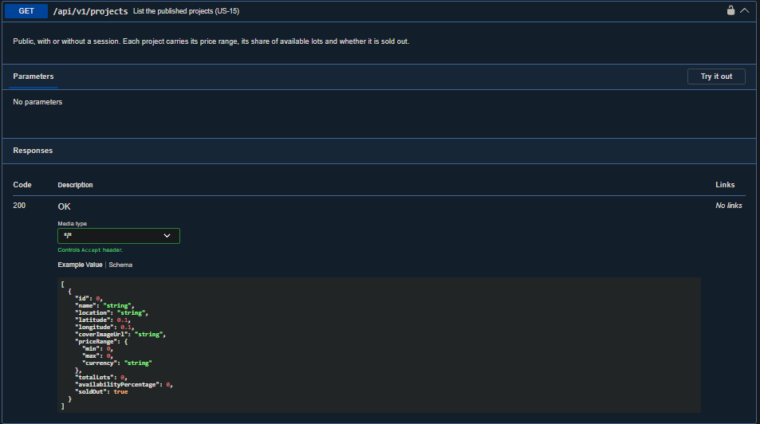
</p>

**Contrato de consulta de lotes y filtros — US-52 / US-15**

Muestra GET /api/v1/projects/{projectId}/lots, filtros de área/precio/estado y viewport. No contiene una respuesta GeoJSON ejecutada; el Example Value visible es {}.

<p align="center">
  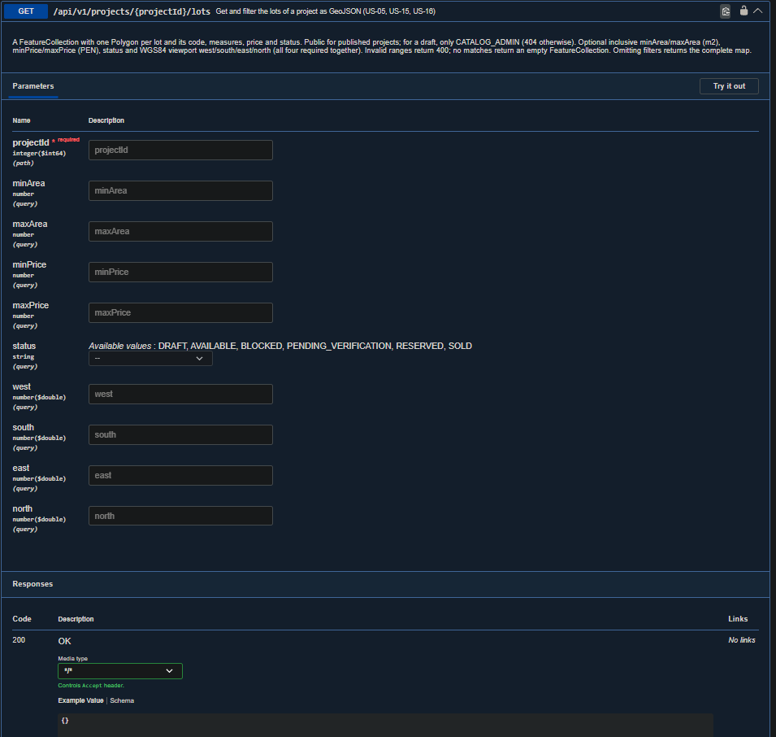
</p>

**Contrato de disponibilidad del servicio — Transversal**

Muestra GET /health con respuestas 200 y 503 documentadas y campos de ejemplo. No contiene Server response ni un estado UP real. La consulta ejecutada en Render con HTTP 200 y API/base UP se incorpora en 4.2.1.8 mediante render-health.jpeg.

<p align="center">
  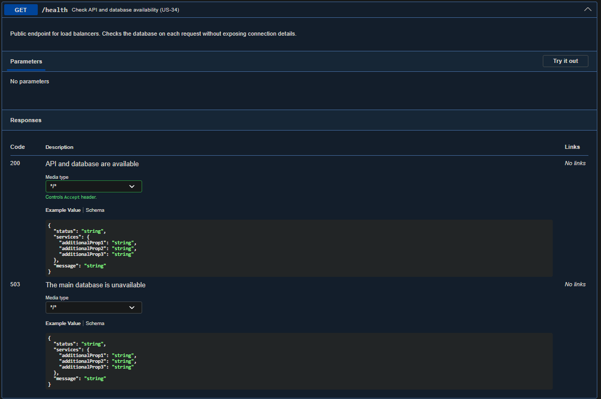
</p>

**Contrato de alta de proyecto — US-51**

Muestra el ejemplo de POST /api/v1/catalog/projects y la respuesta 201 documentada. No muestra un request incompleto enviado ni un rechazo 400.

<p align="center">
  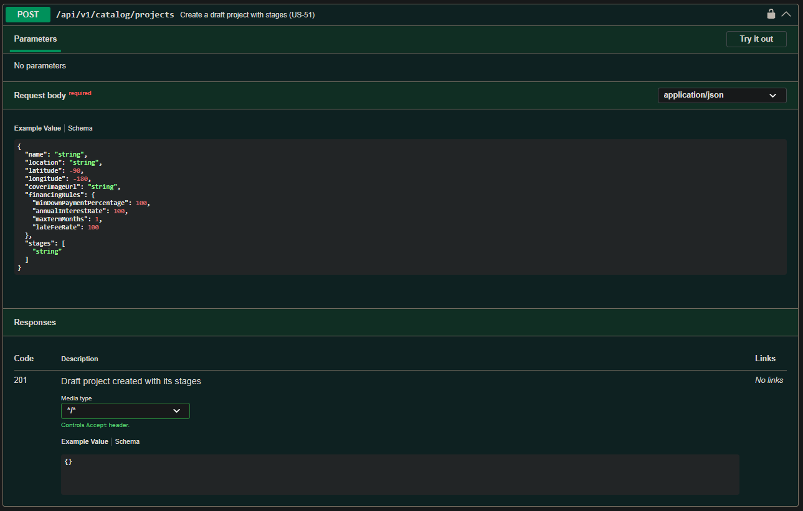
</p>

**Contrato de geometría de lote — US-52**

Muestra el ejemplo de alta de lote y una descripción que indica rechazo 400 de polígonos inválidos. No contiene un polígono inválido enviado ni respuesta real 400.

<p align="center">
  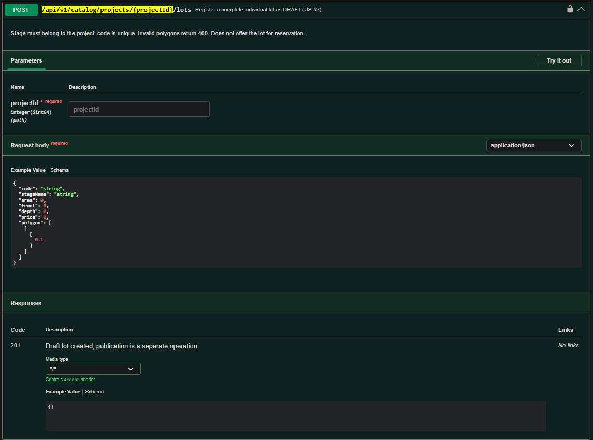
</p>

**Contrato de publicación de lote — US-53**

Muestra PUT de publicación de lote y respuesta 200 documentada. No muestra un lote de proyecto DRAFT enviado ni rechazo real 422.

<p align="center">
  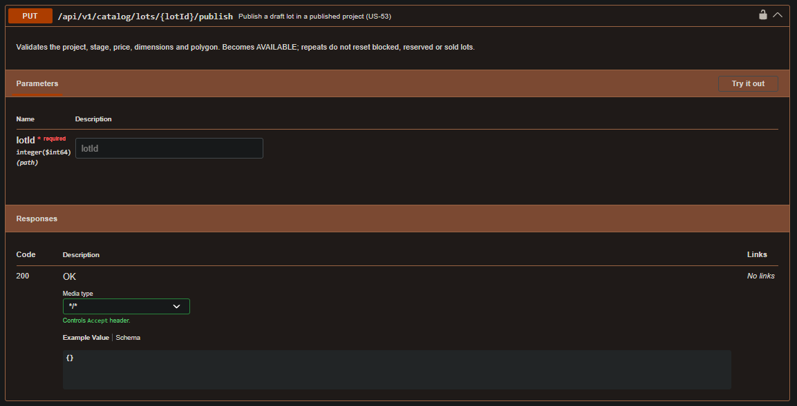
</p>

**Contrato de consulta administrativa — US-51 / US-52 / US-53**

Muestra GET /api/v1/catalog/projects/{projectId}/lots con candado de seguridad y respuesta 200 documentada. No acredita una ejecución con rol BUYER ni un rechazo 403.

<p align="center">
  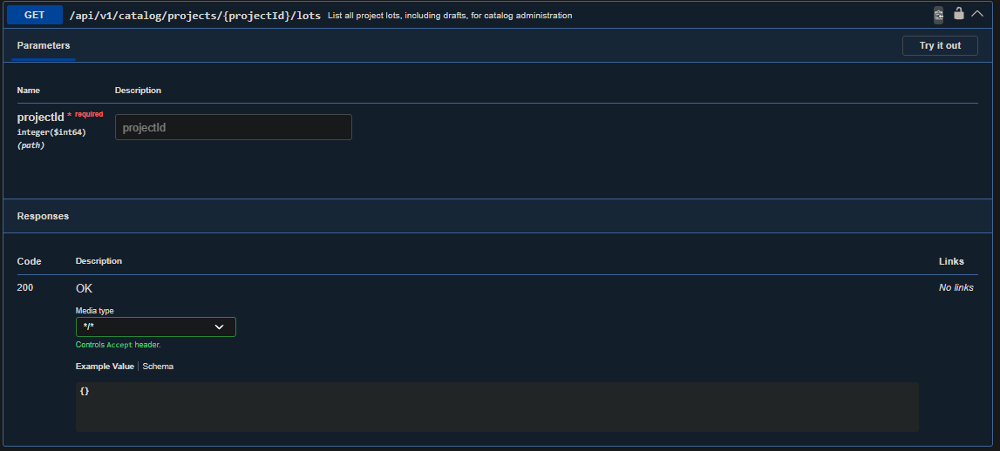
</p>

**Contrato de recepción de registros de campo — Soporte US-04**

Muestra POST /api/v1/field-sync, ejemplos de prospects/reservations y respuesta 201 documentada. No acredita recepción efectiva, prospectsSynced ni registro offline Android.

<p align="center">
  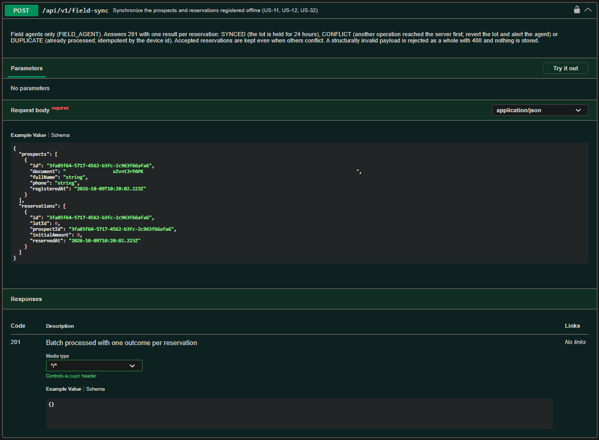
</p>

**Contrato de descarga de portfolio — Complementaria; US-02**

Muestra GET /api/v1/field-sync/portfolio y ejemplo de proyectos, reglas y lotes. La descripción documenta ETag y respuesta condicional; no contiene respuesta real 200 ni ETag observado.

<p align="center">
  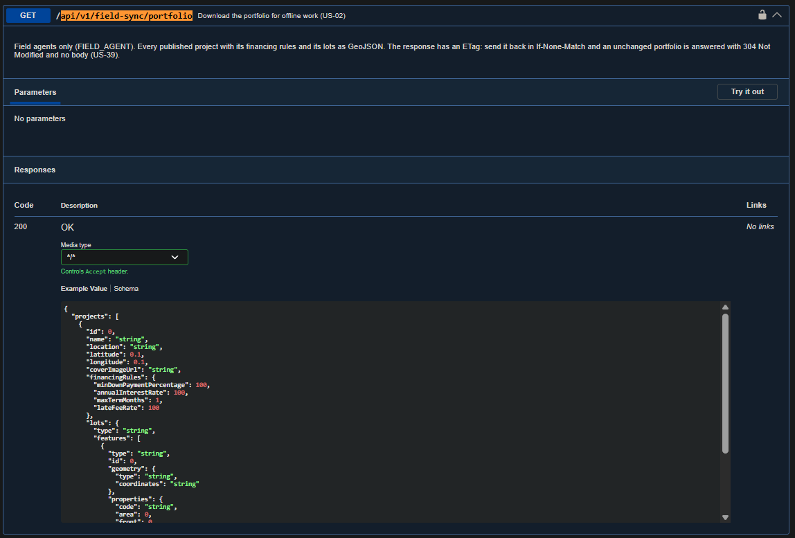
</p>

**Portfolio: rechazo real por falta de autenticación — Complementaria; autenticación**

La captura muestra Request URL https://inmonode-backend.onrender.com/api/v1/field-sync/portfolio y Server response 401. El body contiene code=UNAUTHORIZED y message=Authentication is required or the token is invalid or expired. La petición visible no incluye Authorization ni If-None-Match. No demuestra 304 Not Modified.

<p align="center">
  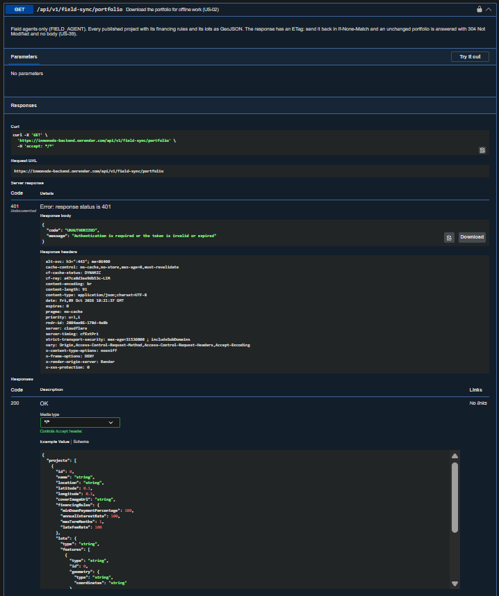
</p>

| Web Services Repository URL | Commit Id | Documentation Change |
| --- | --- | --- |
| InmoNode-Backend — `https://github.com/1ACC0238-2620-13981-NovaCorp-InmoNode/InmoNode-Backend` | b3ce1f6 | Anotaciones de listado/detalle y plano publicado en ProjectsController y ProjectLotsController. |
| InmoNode-Backend — `https://github.com/1ACC0238-2620-13981-NovaCorp-InmoNode/InmoNode-Backend` | 211bdb0 | Contrato y anotaciones de recepción de registros en FieldRecordsController. |
| InmoNode-Backend — `https://github.com/1ACC0238-2620-13981-NovaCorp-InmoNode/InmoNode-Backend` | 2b213d2 | Agrega RealEstateCatalogController y operaciones US-51/52/53, health; actualiza field-sync, filtros y configuración de documentación dev/prod. |

OpenApiConfiguration define bearerAuth JWT y servidor relativo "/" para apuntar al mismo origen de Swagger. La autorización efectiva se obtiene de Spring Security y las reglas de cada controlador; el esquema global no convierte el catálogo público en un endpoint privado.

---
##### 4.2.1.8. Software Deployment Evidence for Sprint Review

La evidencia disponible acredita configuración de empaquetado y un servidor local de validación operativo. El Dockerfile usa compilación multietapa con Maven/Temurin 21 y ejecución JRE 21; Compose declara PostgreSQL 18, RustFS, Mailpit y backend. El workflow de CI declara compilación y pruebas, pero no publicación de una imagen ni despliegue automático. Las capturas aportadas acreditan un servicio Docker publicado en Render desde main, commit cac4444, despliegue exitoso, configuración de Auto-Deploy y health público con HTTP 200 / UP.

| Product (Landing Page / Web Services / Applications) | Deployment Process / Step | Provider / Environment | Account | Cloud Resource | Project Configuration / Integration / Automation | Public URL / Device | Screenshot | Step Explanation / Verified Result |
| --- | --- | --- | --- | --- | --- | --- | --- | --- |
| Web Services | Imagen local del backend | Docker Desktop, Images / Local | Entorno local | No aplica | inmonode-backend:0.0.1, ID 20c1e8c55158, 622.72 MB. | Entorno local | docker-config.jpeg | Inventario de imágenes locales. |
| Web Services | Configuración de CI | GitHub Actions | Organización NovaCorp | Runner ubuntu-latest | ci.yml declara Java 21, Maven verify, Docker/Testcontainers y artefactos Surefire en PR/push a main/develop y ejecución manual. | Repositorio InmoNode-Backend | Configuración versionada | Define compilación y pruebas; la evidencia mostrada corresponde al archivo de configuración. |
| Web Services | Publicar y verificar backend en Render | Render, Web Service Docker Free, Production | My Workspace | InmoNode-Backend | Repositorio InmoNode-Backend, rama main, commit cac4444. Auto-Deploy On Commit; deploy manual por Dashboard. Tomcat puerto 10000. | `https://inmonode-backend.onrender.com` | render-service.jpeg, render-service-config.jpeg, render-deploy-logs.jpeg y render-health.jpeg, incorporadas abajo. | Deploy succeeded / Live: 2026-10-09 04:47:24 GMT-5, duración 4 min 02 s. GET /health real: HTTP 200, API y base UP. |
| Web Services | Verificar servidor local | Windows; aplicación ya activa y PostgreSQL local | Entorno de pruebas | Ninguno | Consultas HTTP de catálogo, plano, health y OpenAPI. | `http://localhost:8081;` PostgreSQL en 127.0.0.1:55432 | Contrato health en 4.2.1.7. | Respuestas HTTP 200 en el entorno local de validación. |

**Imagen local del backend en Docker Desktop**

Docker Desktop muestra la imagen inmonode-backend:0.0.1, identificador 20c1e8c55158 y tamaño 622.72 MB. El inventario incluye postgres:18, axllent/mailpit:v1.31.3, rustfs/rustfs:1.0.0, testcontainers/ryuk:0.14.0 y httpd:2.4-alpine. La captura documenta las imágenes disponibles en el entorno local. La ejecución del servicio se describe mediante las evidencias de Render.

<p align="center">
  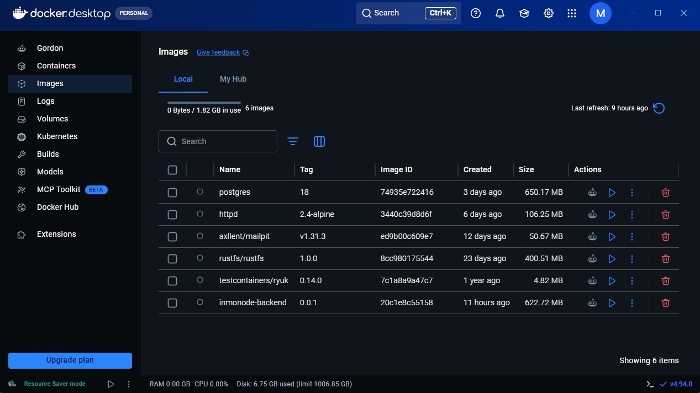
</p>
**Servicio publicado en Render**

La captura del panel identifica InmoNode-Backend como Web Service Docker, plan Free, en el entorno Production. Está conectado al repositorio InmoNode-Backend de NovaCorp, rama main, con commit cac4444 y estado Live. La URL pública es `https://inmonode-backend.onrender.com`. El historial visible incluye dos intentos fallidos y dos exitosos; el despliegue seleccionado presenta estado exitoso.

<p align="center">
  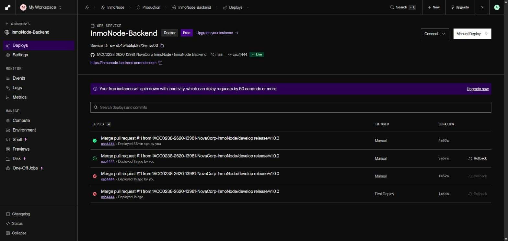
</p>

**Configuración de despliegue en Render**

Settings muestra Auto-Deploy configurado como On Commit. No se observa un Docker Command alternativo en el campo mostrado; el deploy hook permanece oculto. Esa configuración indica automatización habilitada en Render; el despliegue específico de la siguiente captura fue disparado manualmente desde el Dashboard.

<p align="center">
  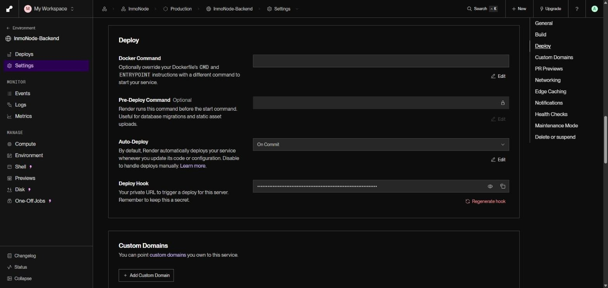
</p>

**Despliegue exitoso y arranque de la aplicación**

El panel identifica el despliegue del 2026-10-09 a las 04:47:24 GMT-5, duración 4 min 02 s, estado Deploy succeeded / Live y origen cac4444. El commit corresponde a cac4444e022d5de63502854e8d1d6b9547a0d870, comprobado en el repositorio local: Merge pull request #11 from 1ACC0238-2620-13981-NovaCorp-InmoNode/develop. Los logs visibles muestran Tomcat iniciado en el puerto 10000, el arranque de InmoNodeBackendApplication y el mensaje Your service is live con la URL pública. La fecha del panel corresponde al despliegue.

La versión desplegada cac4444 y la revisión local 207b208 se identifican por separado. Los resultados de pruebas de 4.2.1.5 corresponden a la revisión local.

<p align="center">
  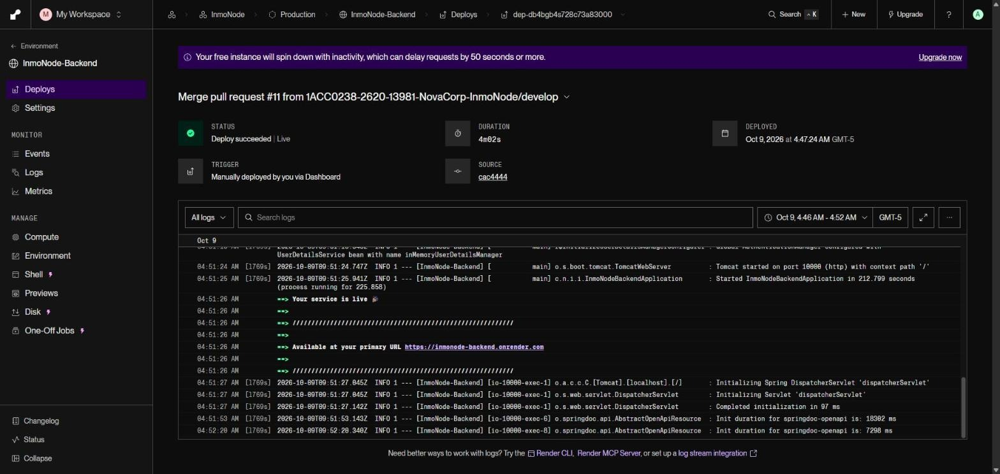
</p>

**Configuración de Health Checks**

La vista Settings / Health Checks muestra el campo Health Check Path sin un valor visible. La consulta manual a /health se presenta en la captura siguiente.

<p align="center">
  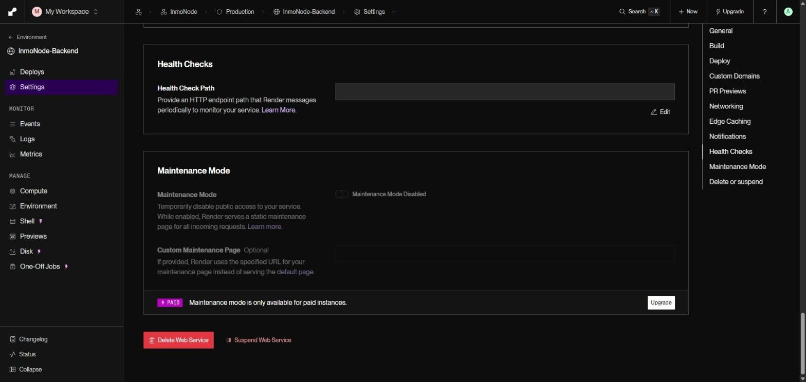
</p>

**Disponibilidad real del backend en Render**

Swagger muestra una petición ejecutada GET a `https://inmonode-backend.onrender.com/health`, con Server response HTTP 200. El Response body contiene status=UP, services.api=UP, services.database=UP y message=All services are available. La respuesta muestra API y base de datos disponibles en el momento de la consulta.

<p align="center">
  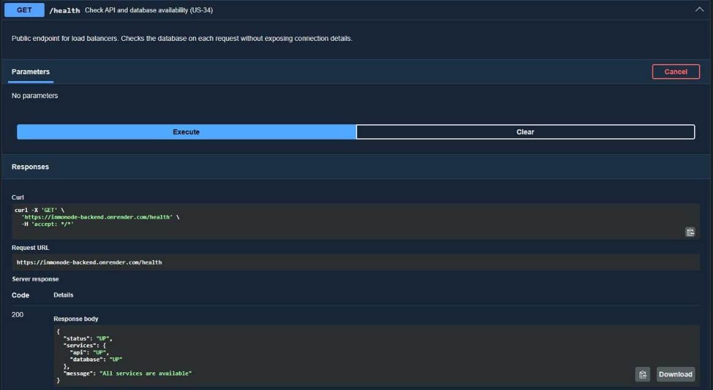
</p>

---
##### 4.2.1.9. Team Collaboration Insights during Sprint

El historial revisado muestra integración de los servicios mediante ramas funcionales y merges de PR #3, #4 y #9. Los commits de catálogo, prospectos y reservas se atribuyen a AngelRocca; becker693 aporta la revisión integrada de health, documentación, pruebas y otras correcciones en 2b213d2. El informe registra trabajo de Becker, Arturo NS y AngelRocca en la rama auditada.

El análisis del historial considera commits alcanzables desde las revisiones indicadas, excluyendo merges, entre el 5 y el 9 de octubre de 2026, en zona horaria GMT-5.

| Repository / audited branch | Git author | Commits in the window | Interpretation |
| --- | --- | --- | --- |
| InmoNode-Backend / develop, 207b208 | AngelRocca | 50 | Implementación distribuida en commits de funcionalidades; incluye historias fuera de las seis seleccionadas. |
| InmoNode-Backend / develop, 207b208 | becker693 | 1 | Commit amplio de correcciones, pruebas y configuración; su tamaño no se refleja en el conteo. |
| InmoNode-Project-Report / feature/chapter-04, 357f3ec | becker693 | 6 | Organización de apartados, matriz y estructura del backlog del capítulo y su planificación. |
| InmoNode-Project-Report / feature/chapter-04, 357f3ec | Arturo NS | 1 | Implementación del capítulo y planificación inicial. |
| InmoNode-Project-Report / feature/chapter-04, 357f3ec | AngelRocca | 1 | Estructura inicial de Chapter IV. |

Los nombres son identidades de autor Git, no equivalencias verificadas con los usernames de la LACX. El número de commits no mide esfuerzo, calidad ni cumplimiento de criterios. La concentración de implementación del backend en un autor sugiere distribuir revisión y transferencia de conocimiento entre líder y colaboradores, especialmente en contratos de catálogo y persistencia de campo.

| Evidencia de colaboración | Datos observados | Interpretación |
| --- | --- | --- |
| GitHub Pulse, 2026-10-02 a 2026-10-09 | 11 PR fusionadas, 0 abiertas, 2 autores y 52 commits excluyendo merges. | Actividad semanal e integración mediante PR. |
| Historial Git, develop en 207b208 | PR #3, #4 y #9 y commits de funcionalidades. | Procedencia e integración de cambios en los servicios. |
| Tablero de Sprint 1 | 12 tareas To Do y 11 To Review; Becker asignado a seis tareas. | Distribución y estado de las tareas en la fecha de la captura. |

**Actividad del backend en GitHub Pulse**

GitHub Pulse muestra el período del 2 al 9 de octubre de 2026: 11 PR fusionadas, 0 abiertas, 2 autores y 52 commits excluyendo merges. El gráfico Top committers representa la distribución de commits entre los autores. La captura no muestra sus nombres ni revisiones individuales de PR.

El período y alcance de Pulse difieren de la auditoría Git del 5 al 9 de octubre sobre develop en 207b208. Los conteos se presentan por separado. El uso de PR refleja integración de cambios; el número de commits no mide esfuerzo ni cumplimiento de historias.

<p align="center">
  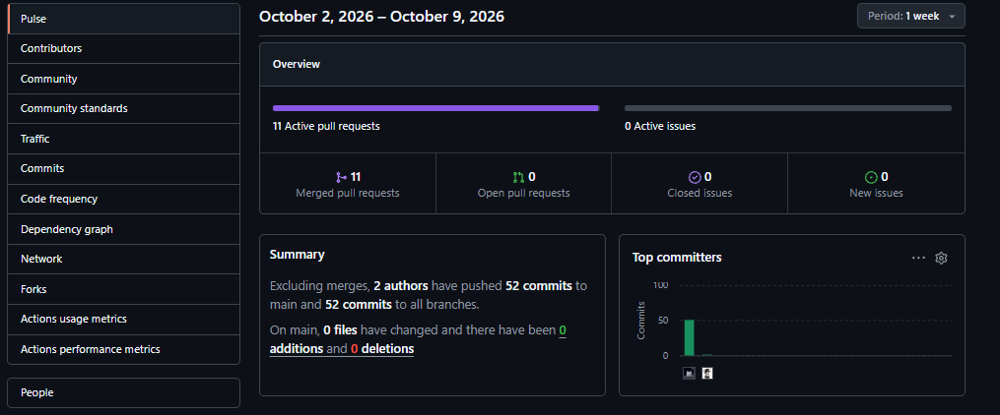
</p>
